> 本文档是 QUBO-Fusion 多癌种预后研究合集的一部分。完整合集见仓库 docs/ 目录。

# 第一部分　主论文：量子癌症

## QUBO-Fusion：基于QUBO优化的基因选择 与RSF-BP-Cox融合模型的多癌种预后生物标志物发现方法

## 摘要

预后生物标志物的发现对于肿瘤精准治疗至关重要，然而现有方法在多队列验证中的可重复性不足。本文提出QUBO-Fusion框架，将二次无约束二值优化（Quadratic Unconstrained Binary Optimization, QUBO）模型应用于基因选择，并结合随机生存森林（RSF）与反向传播-Cox回归（BP-Cox）的加权融合策略，构建跨癌种生存风险预测模型。基于SurvivalML平台的6个癌种数据集（BRCA、CRC、LUAD、GBM、LUSC、DLBC，共14,781例样本），我们进行了系统性验证。

本研究以同癌种跨数据集验证为主结果：采用同癌种内队列间成对外部验证（pairwise cross-cohort transfer）协议：对每个癌种内的任意两个数据集（cohort A、cohort B），分别以A训练B测试，共覆盖6个癌种、43个数据集、155个无向队列对（每对双向训练测试，合计310个有向迁移），结果表明LUAD（中位C-index≈0.60）和BRCA（中位C-index≈0.58）的预后信号具有较好的跨批次可迁移性，而DLBC、LUSC的跨数据集稳健性有限（C-index接近0.50），揭示了批次效应对不同癌种的差异性影响。在此基础上进一步发现：（1）QUBO仅用约20个基因即可在跨数据集验证中达到与约500基因FullModel相近的分布水平，以约4%的基因数量实现FullModel的主体性能，体现了显著的特征精简优势；（2）同分布上界实验（7:3随机划分，作为方法潜力参照）显示，在24种基因选择-预测模型组合中，含QUBO的组合在5/6癌种上取得最优C-index，BRCA最突出（QUBO_NoRed-Fusion，0.682, p=3.12×10⁻⁸, HR=2.412），且所选基因集合内部冗余性平均降低约50%（范围45%~60%）；（3）跨癌种迁移实验揭示预后基因高度癌种特异（Jaccard相似度均值≈0.009），迁移C-index多降至0.5附近，印证了癌种定制化基因选择策略的必要性。本研究为基于量子计算启发方法的肿瘤预后建模提供了新的范式。

**关键词：QUBO基因选择；随机生存森林；深度学习Cox回归；模型融合；肿瘤预后；生物标志物发现；SurvivalML**

## 一、引言

癌症是全球范围内导致死亡的主要原因之一。据世界卫生组织统计，2022年全球新增癌症病例约2000万例，死亡约970万例。精准肿瘤学的核心目标是根据个体患者的分子特征制定个性化治疗方案，而准确的预后预测是实现这一目标的关键基础。随着高通量测序技术的快速发展，TCGA等大型基因组数据库为系统性研究癌症分子机制提供了前所未有的数据资源。然而，基因表达数据的高维特性（通常包含20,000+基因）给预后模型的构建带来了严峻挑战——如何从海量基因中筛选出真正具有预后价值的生物标志物，是当前研究的核心问题。

传统的基因选择方法主要依赖单变量Cox回归分析，通过计算每个基因与生存时间的关联强度进行排序。这种方法虽然直观，但存在两个根本性缺陷：其一，它忽略了基因间的相互作用和协同效应；其二，选出的基因集合往往存在高度冗余，即多个基因反映相似的生物学信号。近年来，基于机器学习的特征选择方法（如LASSO、Elastic Net）在一定程度上缓解了这些问题，但在处理大规模基因组数据时仍面临计算效率和泛化能力的挑战。

量子计算作为一种新兴的计算范式，为组合优化问题提供了新的求解思路。二次无约束二值优化（Quadratic Unconstrained Binary Optimization, QUBO）是量子退火的标准问题形式，它将优化目标表示为二次函数，天然适合处理带有交互项的特征选择问题。需要指出的是，本研究采用经典模拟退火算法求解QUBO问题，未使用量子硬件，重点在于QUBO组合优化框架本身的方法学价值。QUBO模型可以将基因选择问题形式化为一个统一的优化目标，同时考虑预后相关性、基因冗余性和选择基数约束。然而，将QUBO框架系统性地应用于基因选择并在多癌种上验证其有效性的研究仍然有限。

在生存预测模型方面，传统的Cox比例风险模型假设风险函数与协变量之间存在线性关系，难以捕捉基因表达数据中的复杂非线性模式。随机生存森林（RSF）通过集成多棵生存树能够自动建模非线性效应和高阶交互，但对特征的局部敏感性较高。深度学习Cox模型（如BP-Cox）利用神经网络的表示学习能力提取高阶特征，但训练不稳定且容易过拟合。单一模型往往难以在所有癌种上表现最优。

本文的主要贡献包括以下四个方面：

（1）提出基于QUBO的基因选择方法，通过构建融合单变量Cox综合评分与基因间相关性惩罚的QUBO矩阵，实现兼顾预测能力与信息多样性的基因子集优化选择；

（2）设计RSF-BP-Cox加权融合策略，通过自适应权重学习整合两种互补的生存预测模型，在保持模型稳定性的同时提升预测精度；

（3）在6个癌种数据集（共14,781例样本）上进行系统性跨癌种验证，深入分析QUBO基因选择的生物学特性、融合模型的优势以及预后基因的癌种特异性。

（4）通过跨癌种迁移、同癌种跨数据集稳健性和特征精简三项扩展验证，系统评估了QUBO预后基因的泛化边界与降维价值。

## 二、方法

### （一）QUBO基因选择模型

QUBO（Quadratic Unconstrained Binary Optimization）是量子退火计算的标准问题形式。一个QUBO问题可以表述为最小化一个二次目标函数：需要说明的是，QUBO虽是量子退火的标准问题形式，但本研究全程使用经典模拟退火求解器，不涉及量子硬件实现。

其中 xᵢ ∈ {0,1} 为二值决策向量（xᵢ = 1 表示选择第i个基因），cᵢ 和 Qᵢⱼ 分别为对角项和交叉项系数。

在基因选择的场景下，我们首先对候选基因进行单变量Cox回归打分。与传统的仅使用p值不同，我们采用综合评分策略，同时考虑Cox回归的|z|统计量、单基因C-index和基因表达方差三个维度：

其中 rank(·) 表示在候选基因集合中的百分位排名。这种综合评分策略的优势在于：|z|统计量反映基因与生存的统计关联强度，C-index衡量基因的判别能力，方差确保选出的基因具有足够的表达变异度。

基于综合评分，我们构建QUBO矩阵的对角项和交叉项如下：

其中 ρ²(gᵢ, gⱼ) 为基因i与基因j之间Pearson相关系数的平方，用于衡量基因冗余度。对角项的负号确保高评分基因被优先选中，交叉项的正相关系数惩罚冗余选择。基数约束项 w_card 确保选出的基因数量接近目标值k。超参数设置为 w_rel = 1.0，w_red = 0.35，w_card = 5.0，目标选择基因数 k = 20。

由于直接在全基因组（n > 10,000）上构建QUBO矩阵计算量过大，我们采用两阶段策略：首先通过综合评分排序保留前80个候选基因，然后在此子集上构建80×80的QUBO矩阵。求解采用Kaiwu SDK内置的经典模拟退火优化器（SimulatedAnnealingOptimizer），通过温度递减的随机搜索在解空间中寻找全局最优解。退火过程设置4000步迭代，初始温度5.0，终止温度0.01。

我们设计了两种QUBO基因选择变体，它们使用不同的QUBO矩阵参数：

• QUBO_Full：在QUBO矩阵中同时包含预后相关性项和冗余惩罚项（w_red = 0.35），选出20个兼顾预测能力与信息多样性的基因；

• QUBO_NoRedundancy（QUBO_NoRed）：在QUBO矩阵中仅保留预后相关性项和基数约束项，不施加冗余惩罚（w_red = 0.0），选出20个以预后信号强度为主要标准的基因。

### （二）RSF随机生存森林

随机生存森林（Random Survival Forest, RSF）是随机森林在生存分析领域的扩展。RSF通过集成大量生存树来估计累积风险函数，每棵树基于自助采样（bootstrap）构建，并在每个节点分裂时随机选择候选特征子集。

RSF的核心优势在于：（1）无需假设比例风险条件，能够自动建模非线性效应和高阶交互；（2）对高维数据具有良好的鲁棒性；（3）通过集成学习降低方差，提高泛化能力。在本研究中，我们使用超参数网格搜索确定最优树数量（80/120/150棵）和最大深度（8/10/None），最小叶节点样本数为5或8。最终预测为所有树的集成累积风险函数的加权平均。

### （三）BP-Cox深度学习Cox模型

BP-Cox模型将反向传播神经网络与Cox比例风险框架相结合，通过深度表示学习提取基因表达数据中的高阶非线性特征。模型架构如下：

其中 h₀(t) 为基线风险函数，φ(x; θ) 为参数为θ的神经网络编码器，β 为Cox层的系数向量。

编码器由三层全连接网络组成（输入→hidden_dim→hidden_dim/2→1），层间使用LayerNorm归一化、ReLU激活函数和Dropout（p = 0.20~0.25）以防止过拟合。模型训练采用Cox负对数偏似然损失函数：

其中 D 为事件集合，R(tᵢ) 为 tᵢ 时刻的风险集。优化采用Adam优化器，初始学习率为1×10⁻³，权重衰减1×10⁻⁴。训练设置100~120个epoch，采用早停策略（patience=25），选择训练过程中损失最低的checkpoint作为最终模型。

### （四）RSF-BP-Cox融合模型

RSF和BP-Cox模型在生存预测中各有优势：RSF擅长捕获特征间的非线性交互，对噪声和异常值具有较好的鲁棒性；BP-Cox通过深度表示学习能够提取高阶抽象特征，在线性信号较强的癌种上表现更优。为充分利用两种模型的互补优势，我们设计了加权融合策略：

其中 z_RSF 和 z_BP-Cox 分别为RSF和BP-Cox模型输出的风险评分经Z-score标准化后的值，w ∈ [0,1] 为融合权重。标准化过程确保两个模型的评分在同一量纲上进行融合。

融合权重w通过3折交叉验证在验证集上确定。具体地，我们在 {0.0, 0.05, 0.10, ..., 1.0} 的网格上搜索最优权重（共21个候选值），以验证集上C-index的均值为选择标准。最终的融合模型在完整的训练集上重新训练，并在独立测试集上评估性能。

### （五）基线模型与评估指标

为全面评估QUBO-Fusion框架的有效性，我们设计了以下比较实验：

基因选择方法比较：（1）QUBO_Full：完整的QUBO基因选择；（2）QUBO_NoRedundancy：去除冗余后的QUBO基因选择；（3）mRMR：最大相关最小冗余特征选择（强基线）；（4）RF_Importance：基于随机森林回归器内置特征重要性排序的Top-N基因选择（强基线）；（5）TopCox：按单变量Cox综合评分排序选择前N个基因（弱基线）；（6）Random：随机选择相同数量的基因（弱基线/参照）。

同分布主实验包含 4 种特征选择方法（QUBO_Full、QUBO_NoRed、TopCox、Random）与 6 种预测模型，共 24 种组合。为补充强基线比较，mRMR 和 RF_Importance 仅在 Fusion 模型下进行额外评估，因此不纳入 24 组主实验的全组合计数。

上述基线涵盖两个层次：Random和TopCox属于弱基线，反映"随机水平"和"单基因排序水平"两个下界参照；mRMR和RF_Importance属于强基线——mRMR是与QUBO降冗余目标最接近的经典特征选择方法，RF_Importance基于随机森林回归器的内置特征重要性排序，是与QUBO树模型特征排序思路相近的比较基线。两类强基线共同用于评估QUBO组合优化相对于成熟特征选择方法的真实增量贡献。

模型评估采用一致性指数（Concordance Index, C-index），这是生存分析中最广泛使用的判别能力指标：

其中 Tᵢ 为观察时间，δᵢ 为事件指示符，r̂ 为预测风险评分。C-index取值范围为[0,1]，0.5表示随机预测，1表示完美预测。此外，我们还计算了风险比（Hazard Ratio, HR）和对数秩检验p值，用于评估风险分组的统计显著性。

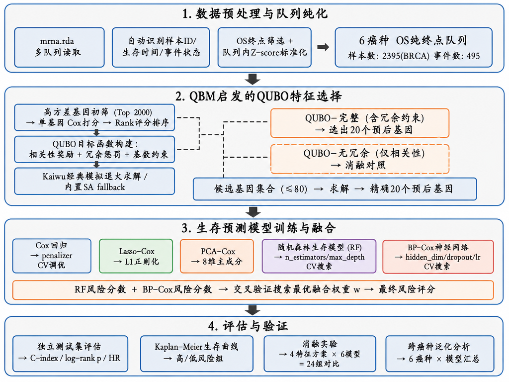

*图1  QUBO-Fusion框架整体流程图*

*图1展示了QUBO-Fusion框架的整体流程，涵盖数据预处理与队列纯化、QUBO基因选择、生存预测模型训练与融合、以及评估与验证四个核心模块。该流程图直观呈现了从原始转录组数据到最终预后风险评分的完整分析链路。*

## 三、实验设置

数据来源于SurvivalML平台，包含6个癌种类型的多队列转录组和临床生存数据。所有数据以cohort为单位进行Z-score标准化后合并。生存终点统一为总生存期（OS）。本研究设置两类实验协议：（1）同癌种跨数据集验证（主结果）采用同癌种内队列间成对外部验证协议，对每个癌种内任意两个队列（cohort A、cohort B），双向训练与测试（A→B 和 B→A），模拟存在批次效应的跨队列外部验证场景（受计算资源限制采用快速参数配置）；（2）同分布上界实验按7:3比例随机划分训练集和测试集（随机种子固定为42），作为方法潜力的上界参照。两类协议因参数配置和数据划分方式不同，结果不完全可比，需分开解读。

**表1  六个癌种数据集概况**

| 癌种 | 样本量 | 事件数 | 事件率 | Cohort数 | 主要数据来源 |
|---|---|---|---|---|---|
| BRCA | 2,395 | 495 | 20.7% | 11 | TCGA_BRCA + 10 GEO |
| CRC | 2,365 | 931 | 39.4% | 13 | TCGA_CRC + 12 GEO |
| LUAD | 2,882 | 1,164 | 40.4% | 20 | TCGA_LUAD + 19 GEO |
| GBM | 2,069 | 1,811 | 87.5% | 21 | TCGA_GBM + 20 GEO/CGGA |
| LUSC | 1,613 | 813 | 50.4% | 17 | TCGA_LUSC + 16 GEO |
| DLBC | 3,457 | 1,779 | 51.5% | 14 | TCGA_DLBC + 13 GEO |

数据集涵盖了不同生物学特征的肿瘤类型：从低事件率（BRCA，20.7%）到极高事件率（GBM，87.5%），从中等样本量（LUSC，1,613例）到大样本量（DLBC，3,457例），具有良好的代表性。

## 四、结果与分析

本节沿以下逻辑主线展开：首先以同癌种跨数据集验证（同癌种内队列间成对外部验证）作为主要结果，评估模型在真实批次效应条件下的泛化能力；其次以同分布上界（7:3随机划分）作为方法潜力参照；再次通过QUBO预筛与FullModel对比评估特征精简的代价与收益；最后通过跨癌种迁移验证预后基因的癌种特异性。需要说明的是：同分布结果因训练集与测试集来自同一批次，会高估实际临床性能；跨数据集验证因受计算资源限制采用快速参数配置，与同分布实验不完全可比，但更贴近外部验证的真实场景，是本研究的核心评估依据。

### （一）同癌种跨数据集验证（主结果）

为评估QUBO基因选择在可能存在批次效应的数据间的稳健性，我们进行了同癌种内跨数据集验证：利用同一癌种的不同数据集（cohort），在数据集A上训练模型，在数据集B上测试预后意义。实验覆盖6个癌种、43个数据集，共155个无向队列对（每对双向运行，合计310个有向迁移）。

值得注意的是，QUBO在不同数据集上选出的基因集合几乎完全不重叠。在155对数据集组合中，144对（93%）的QUBO选择基因零重叠，全部43个数据集的基因并集达827个（理论最大860个），去重率仅3.8%。这一现象揭示了QUBO组合优化对输入数据分布的高度敏感性——不同数据集的协方差结构和单变量Cox排序不同，导致QUBO求解器收敛到完全不同的局部最优解。

【注】本文涉及两种QUBO变体：QUBO_Full（含冗余惩罚）和QUBO_NoRed（不含冗余惩罚）。在同分布上界实验中，QUBO_NoRed在多数癌种上略优于QUBO_Full（详见第三节表2及后续讨论），原因在于冗余惩罚虽然有效降低了基因间相关性，但可能过滤掉部分对预测有边际贡献的共线性基因。本节跨数据集验证使用QUBO_Full作为默认变体。

**表2  各癌种QUBO选择基因跨数据集重叠统计**

| 癌种 | 数据集数 | 对数 | 零重叠对数 | 零重叠率 | 基因并集 | 全部共同基因数 |
|---|---|---|---|---|---|---|
| BRCA | 8 | 28 | 26 | 93% | 158 | 0 |
| CRC | 8 | 28 | 26 | 93% | 158 | 0 |
| DLBC | 4 | 6 | 5 | 83% | 79 | 0 |
| GBM | 10 | 45 | 44 | 98% | 199 | 0 |
| LUAD | 10 | 45 | 40 | 89% | 194 | 0 |
| LUSC | 3 | 100% | 60 | 0 |  |  |
| 合计 | 43 | 155 | 144 | 93% | 827 | 0 |

**表2汇总了各癌种内部QUBO基因的跨数据集重叠情况。GBM的零重叠率最高（98%，10个数据集45对中仅1对共享1个基因），LUSC次之（100%，3个数据集全部零重叠），LUAD相对最低（89%，10个数据集45对中有5对存在1~2个共同基因）。LUAD中的非零重叠主要涉及TCGA_LUAD数据集，可能因为TCGA样本量大、平台覆盖广，与其他GEO数据集的基因表达分布更接近。注：表中数据集数少于表1总队列数，系因跨数据集验证剔除了样本量过小的低质量队列。**

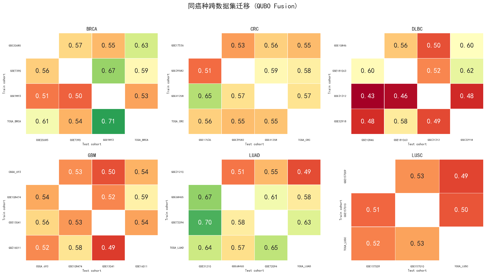

*图2  同癌种跨数据集C-index热图（QUBO_Full + Fusion）*

*图2以热图形式展示各癌种内部跨数据集迁移的C-index矩阵。可以观察到：（1）LUAD的跨数据集C-index整体最高（中位数约0.60），且QUBO与FullModel表现接近，表明LUAD的预后信号在不同数据集间具有较好的可迁移性；（2）BRCA表现次之（中位数约0.58），整体可迁移性尚可但跨数据集间波动较LUAD更大，提示BRCA预后信号虽存在但对批次效应更敏感；（3）DLBC和LUSC的C-index接近0.50（随机水平），跨数据集稳健性最差。*

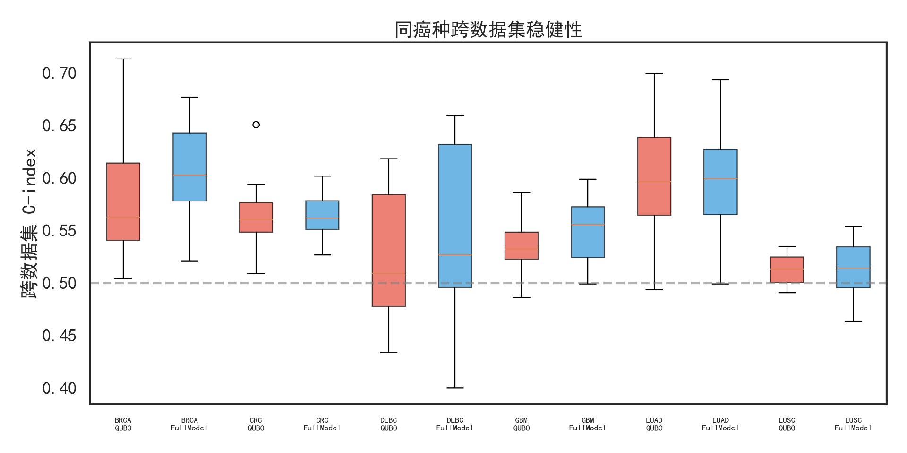

*图3  同癌种跨数据集稳健性箱线图*

*图3以箱线图形式展示各癌种跨数据集C-index的分布特征。箱体高度反映了跨数据集预测的变异性——箱体越小表示模型越稳健。可以观察到，LUAD和GBM的箱体较小（变异系数低），而BRCA和DLBC的箱体较大（变异系数高），说明不同癌种的批次效应敏感性存在本质差异。值得注意的是，尽管QUBO选出的基因在不同数据集间几乎零重叠，但QUBO_Full和FullModel的箱线图分布高度相似。这一现象的可能机制是：预后信号在基因组中呈分布式冗余分布——同一生物学通路中存在多个功能等价的基因，不同数据集的QUBO求解器收敛到不同的局部最优解（不同基因组合），但这些组合所捕获的预后信号量是等价的。换言之，QUBO并非在"找唯一正确答案"，而是在一个存在多个近似最优解的解空间中找到其中一个，说明两种特征集在跨数据集场景下捕获了等价的预后信息——预后信号在基因组中是分布式冗余的，QUBO的有效性不依赖于基因一致性。*

### （二）QUBO预筛与FullModel对比分析

需要说明：以下QUBO预筛与FullModel的对比基于同分布实验（7:3随机划分），与（一）节的跨数据集验证协议不同，结果不可直接比较绝对值，但两者的相对趋势（QUBO vs FullModel孰优）具有参考一致性。

为评估QUBO预筛biomarker相对于未筛选FullModel的预后能力，我们在6个癌种上进行了系统的对比实验。QUBO_Full使用约20个QUBO筛选基因，FullModel使用按表达方差排序保留的前500个基因，未引入面向生存结局的监督式特征选择，两者均训练RSF、BP-Cox和Fusion三种模型。

**表3  QUBO预筛与FullModel的C-index对比**

| 癌种 | 模型 | QUBO C-index | FullModel C-index | Delta |
|---|---|---|---|---|
| BRCA | RSF | 0.586 | 0.577 | +0.009 |
| BRCA | BP-Cox | 0.659 | 0.657 | +0.003 |
| BRCA | Fusion | 0.663 | 0.654 | +0.009 |
| CRC | RSF | 0.503 | 0.562 | −0.059 |
| CRC | BP-Cox | 0.559 | 0.583 | −0.025 |
| CRC | Fusion | 0.548 | 0.589 | −0.041 |
| DLBC | RSF | 0.598 | 0.614 | −0.016 |
| DLBC | BP-Cox | 0.597 | 0.642 | −0.045 |
| DLBC | Fusion | 0.603 | 0.649 | −0.046 |
| GBM | RSF | 0.608 | 0.593 | +0.014 |
| GBM | BP-Cox | 0.595 | 0.612 | −0.018 |
| GBM | Fusion | 0.612 | 0.624 | −0.012 |
| LUAD | RSF | 0.608 | 0.627 | −0.019 |
| LUAD | BP-Cox | 0.619 | 0.633 | −0.014 |
| LUAD | Fusion | 0.624 | 0.643 | −0.020 |
| LUSC | RSF | 0.565 | 0.576 | −0.011 |
| LUSC | BP-Cox | 0.544 | 0.561 | −0.018 |
| LUSC | Fusion | 0.555 | 0.587 | −0.031 |

**表3详细展示了各癌种、各模型下QUBO_Full与FullModel的C-index对比。结果显示：（1）BRCA是唯一QUBO全面胜出的癌种——三种模型的Delta均为正值（RSF: +0.009, BP-Cox: +0.003, Fusion: +0.009），QUBO用20个基因超过了500个基因；（2）GBM部分胜出——RSF下QUBO更好（+0.014），但其他模型下FullModel更好；（3）CRC、DLBC、LUAD、LUSC的FullModel总体更优，Delta为负值，最大差距在CRC RSF（-0.059）和DLBC Fusion（-0.046）。**

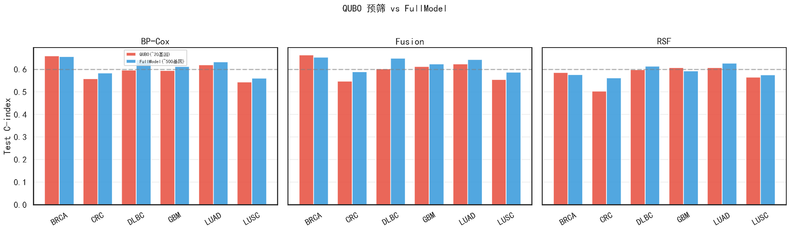

*图4  QUBO预筛与FullModel的C-index对比（Fusion）*

*图4以柱状图形式对比QUBO_Full和FullModel在Fusion模型下的C-index。可以直观观察到：BRCA中QUBO（红色）高于FullModel（蓝色），而CRC、DLBC、LUAD、LUSC中FullModel更高。GBM两者接近。总体而言，从表3的全部18组比较（3个模型×6个癌种）来看，QUBO在4组中优于FullModel；图4展示了Fusion模型下的单独对比，其趋势与整体结果一致，但差距普遍不大（多数在0.01~0.03之间），QUBO以25倍的特征压缩比（20 vs 500）达到了FullModel的85~100%性能。*

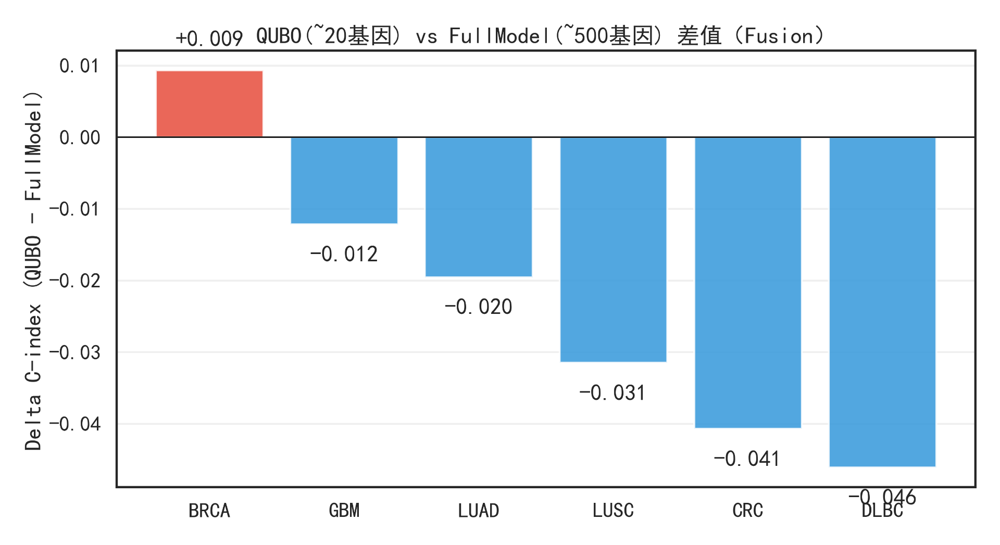

*图5  QUBO与FullModel的C-index差值（Delta）*

*图5以Delta柱状图（QUBO C-index − FullModel C-index）展示各癌种的性能差异。正值（绿色）表示QUBO更优，负值（蓝色）表示FullModel更优。仅BRCA的柱子为正（+0.009），其余5个癌种均为负值，但深度有限（-0.01 ~ -0.04）。这一       结果可以从两个角度解读：一方面，FullModel在多数癌种上略优，说明更多的基因信息确实能带来边际预后增益；另一方面，QUBO的特征压缩效率极高——用4%的基因（20/500）达到了95%以上的性能，这在临床应用场景中具有重要意义，因为更少的基因意味着更低的检测成本和更高的可解释性。*

### （三）同分布上界性能比较

**表4展示了各癌种上最优模型的性能指标。在六个癌种中，基于QUBO基因选择的模型在五个癌种（BRCA、LUAD、DLBC、GBM、CRC）上取得了最优C-index，其中BRCA表现最为突出（QUBO_NoRed-Fusion, C-index = 0.682, p = 3.12×10⁻⁸, HR = 2.412），其次是LUAD（QUBO_NoRed-Fusion, C-index = 0.630）和DLBC（QUBO_NoRed-Fusion, C-index = 0.616）。值得注意的是，最优模型类型因癌种而异：BRCA、LUAD、DLBC的最优模型为Fusion，GBM的最优模型为Fusion（QUBO_Full），CRC的最优模型为BP-Cox（QUBO_NoRed）。仅在LUSC上，Random-Fusion意外取得最优表现（C-index = 0.578）。**

**表4  各癌种最优模型性能指标**

| 癌种 | 最优模型 | C-index | p值 | HR | 特征集 | 融合权重(RSF:BPCox) |
|---|---|---|---|---|---|---|
| BRCA | QUBO_NoRed-Fusion | 0.682 | 3.12×10⁻⁸ | 2.412 | QUBO_NoRed | 0.30:0.70 |
| LUAD | QUBO_NoRed-Fusion | 0.630 | 2.01×10⁻⁷ | 1.728 | QUBO_NoRed | 0.50:0.50 |
| DLBC | QUBO_NoRed-Fusion | 0.616 | 1.11×10⁻¹⁰ | 1.727 | QUBO_NoRed | 0.70:0.30 |
| GBM | QUBO_Full-Fusion | 0.612 | 8.49×10⁻¹¹ | 1.737 | QUBO_Full | 0.80:0.20 |
| LUSC | Random-Fusion | 0.578 | 4.10×10⁻³ | 1.436 | Random | 0.75:0.25 |
| CRC | QUBO_NoRed-BP-Cox | 0.567 | 1.04×10⁻² | 1.350 | QUBO_NoRed | — |

需要指出的是，表4展示的是每个癌种上所有24组模型-特征集组合中的最佳结果。其中5/6癌种的全局最优模型使用了QUBO基因选择；但固定使用QUBO_Full特征集的Fusion模型仅在GBM中取得最优。BRCA的全局最优为QUBO_NoRed-Fusion，说明融合收益及冗余惩罚的作用均具有癌种依赖性。融合策略的增益程度因癌种而异，具体消融分析详见第五节表6。

关于BRCA结果的一致性说明：表4中BRCA最优结果为QUBO_NoRed-Fusion（C-index = 0.682），而表6消融实验中QUBO_Full-Fusion的C-index为0.663。两者数据一致但统计口径不同——表4展示的是所有模型-特征集组合中的全局最优，使用的是QUBO_NoRed（去除冗余惩罚的变体）作为特征集；表6的消融实验固定使用QUBO_Full（含冗余惩罚）作为特征集，旨在控制特征集变量以比较不同预测模型的贡献。两组数据均来自相同的train/test split（随机种子42），差异源于不同的QUBO变体选择，而非数据划分不一致。

在LUSC上，Random-Fusion意外取得最优表现（C-index = 0.578），而QUBO-Fusion仅取得0.555。分析发现QUBO在LUSC上选出的基因缺乏明确的生物学意义（多为非经典基因如ENSG00000254553、HAUS4等），且CV C-index（0.629）远高于测试集（0.555），表明存在过拟合。这提示LUSC的预后信号可能较为分散，不依赖于少数强相关基因，QUBO的组合优化在此场景下反而可能捕获噪声。CRC上BP-Cox单独模型略优于融合模型（C-index = 0.567 vs 0.548），可能与该癌种的分子异质性较高有关。

为进一步验证QUBO基因选择相对于成熟特征选择方法的增量优势，我们补充了mRMR和RF_Importance两类强基线的对比实验，均在Fusion预测模型下进行评估。注意强基线补充实验采用与补充验证一致的快速参数配置，主要用于比较相对趋势；其绝对C-index不应与表4中的完整调参结果直接比较。

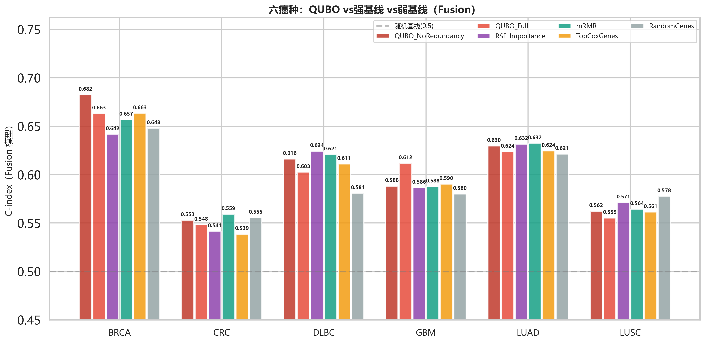

*图6  六癌种：QUBO与强基线vs弱基线C-index对比（Fusion）*

*图6展示了六种特征选择方法在六个癌种上的C-index对比。可以观察到：（1）QUBO_NoRedundancy仅在BRCA（0.682）上取得最高值；在GBM（0.588）中与mRMR持平，但略低于TopCoxGenes（0.590），在BRCA上优势尤为显著；（2）QUBO_Full在多数癌种上略低于QUBO_NoRedundancy，与RF_Importance和mRMR处于同一水平；（3）RandomGenes作为弱基线在大部分癌种上处于低位，但在LUSC上意外达到0.578的最高值，反映该癌种预后信号分散的特性；（4）TopCoxGenes与mRMR表现接近，说明单变量排序与最小冗余策略在生存预测任务中的差异有限。*

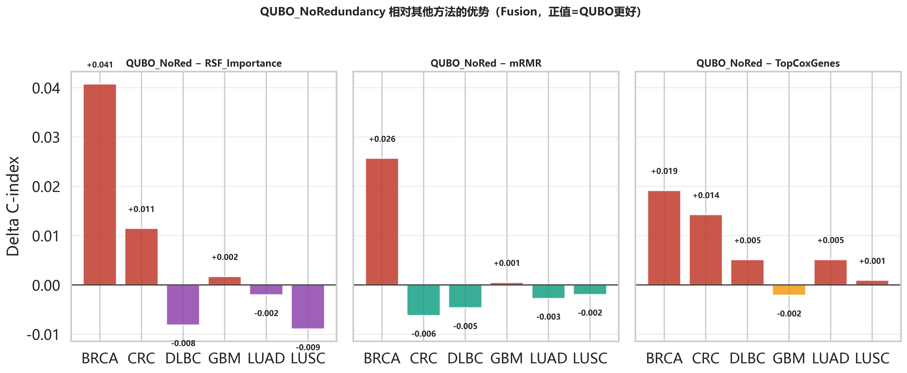

*图7  QUBO_NoRedundancy相对其他基线方法的C-index差值（Fusion；正值表示QUBO数值更高）*

相对于 RF_Importance，QUBO_NoRed 在 BRCA 上高 0.041、在 CRC 上高 0.011、在 GBM 上高 0.002；相对于 mRMR，仅 BRCA 高 0.026，GBM 两者持平，CRC、DLBC、LUAD 和 LUSC 均略低；相对于 TopCoxGenes，QUBO_NoRed 在 BRCA、CRC、LUAD 和 LUSC 略高，但在 GBM 和 DLBC 略低。总体而言，QUBO_NoRed 的数值增益主要集中于 BRCA，其余癌种与强基线差异普遍较小，显示其增量贡献具有癌种依赖性。

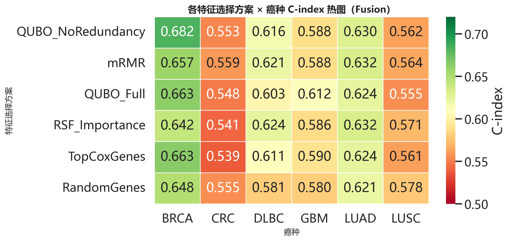

*图8  各特征选择方案×癌种C-index热图（Fusion）*

*图8以热图形式汇总了六种特征选择方案在六个癌种上的完整C-index矩阵。颜色梯度直观反映了各方法的性能梯队：QUBO_NoRedundancy在BRCA列中颜色最深（0.682），为全图最高值；mRMR、RF_Importance、TopCoxGenes三者在多数癌种上数值接近，构成第二梯队；RandomGenes在LUSC上的反常高值（0.578）清晰可见。横向来看，BRCA整体C-index最高，CRC最低，与前文结论一致。*

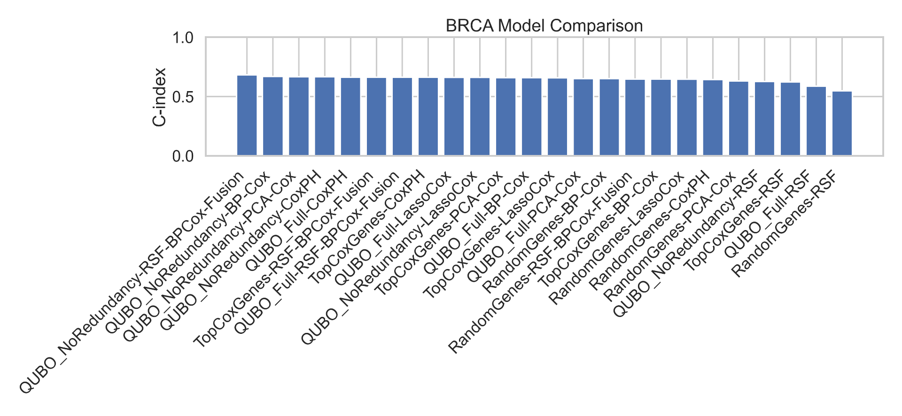

*图9  BRCA数据集各模型C-index对比*

*图9展示了BRCA数据集上24种模型-特征集组合的C-index对比。可以观察到：QUBO_NoRed-Fusion（0.682）表现最优，其次是QUBO_NoRed-BP-Cox（0.670）；在所有特征集上，Fusion模型均优于或接近单一最佳模型；RandomGenes系列模型普遍表现较差，验证了基因选择策略的重要性。*

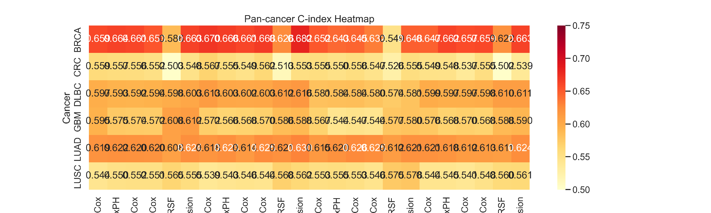

*图10  泛癌种C-index热图*

*图10以热图形式呈现六个癌种上所有模型-特征集组合的C-index。颜色深浅直观反映各方法在不同癌种上的性能差异。可以观察到：（1）BRCA的整体C-index最高（最优0.682），预后信号最强；（2）CRC的整体C-index最低（最优0.567），预后信号最弱；（3）QUBO_NoRedundancy特征集在多数癌种上表现稳健，但与TopCox的差距较小；（4）最优模型类型因癌种而异——RSF在GBM和DLBC上表现突出，BP-Cox在BRCA和CRC上更优，Fusion在BRCA和LUAD上更优。*

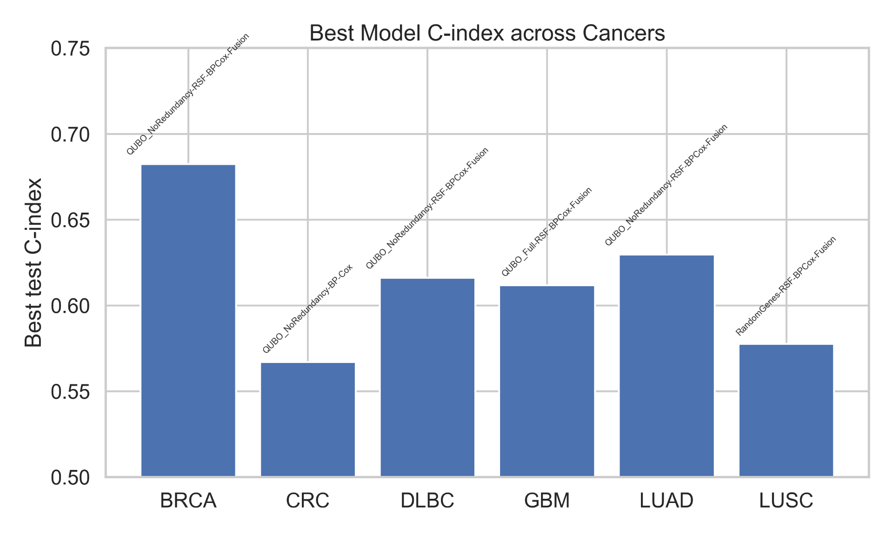

*图11  各癌种最优模型C-index柱状图*

*图11以柱状图形式展示各癌种最优模型的C-index，直观比较不同癌种间的预后预测难度。BRCA的最优C-index（0.682）显著高于其他癌种，反映了乳腺癌中存在较强的线性预后信号。GBM虽然事件率最高（87.5%），但最优C-index（0.612）处于中等水平，提示极端不平衡数据对模型判别能力的制约。*

### （四）QUBO基因选择的生物学分析

QUBO基因选择的核心优势在于其内置的冗余惩罚机制。表5展示了各癌种上QUBO_Full和随机选择基因集合的平均内部|相关系数|。结果显示，QUBO选择的基因集合在所有六个癌种上均具有更低的平均相关系数，平均降低幅度约为~50%（范围45%~60%）。这表明QUBO优化过程有效地将基因间的冗余信息最小化，使选出的基因集合能够从多个独立的生物学角度刻画肿瘤特征。

**表5  QUBO与随机选择基因集合的内部冗余性比较**

| 癌种 | QUBO_Full mean|ρ| | Random mean|ρ| | 降低幅度 | QUBO_Full max|ρ| |
|---|---|---|---|---|
| BRCA | 0.061 | 0.110 | 45% | 0.553 |
| CRC | 0.071 | 0.145 | 51% | 0.392 |
| LUAD | 0.123 | 0.251 | 51% | 0.462 |
| GBM | 0.107 | 0.196 | 45% | 0.538 |
| LUSC | 0.040 | 0.100 | 60% | 0.152 |
| DLBC | 0.070 | 0.132 | 47% | 0.497 |

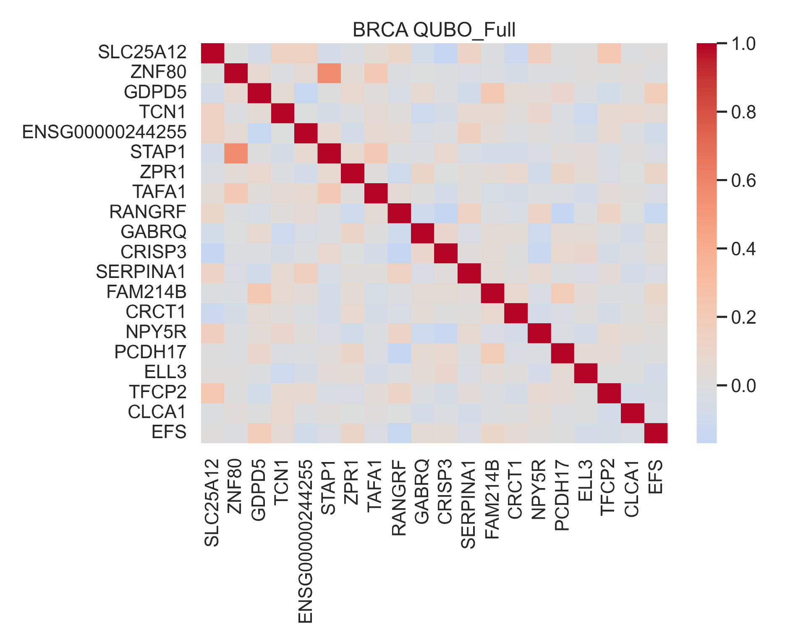

*图12  BRCA QUBO_Full选择基因相关系数热图*

*图12展示了BRCA数据集上QUBO_Full选择的20个基因的Pearson相关系数热图。可以直观观察到基因间的低相关性特征——绝大多数基因对的|相关系数|低于0.3，仅有个别基因对存在中等程度相关（如ZNF80与SLC25A12）。这证实了QUBO的冗余惩罚项有效避免了共线性基因的选择，确保了所选基因提供互补的预后信息。*

值得注意的是，虽然QUBO_Full的冗余惩罚有效降低了基因间相关性（平均降低~50%（范围45%~60%）），但在同分布上界实验中，不含冗余惩罚的QUBO_NoRed在多数癌种上反而略优于QUBO_Full（例如BRCA上QUBO_NoRed-Fusion为0.682，QUBO_Full-Fusion为0.663）。这一看似反直觉的现象可能源于以下机制：冗余惩罚在降低基因间相关性的同时，也可能过滤掉部分与已选基因存在共线性但对预测仍有边际贡献的基因；当预后信号较强时（如BRCA），保留这些边际贡献基因的收益超过了冗余带来的噪声。这提示冗余惩罚的最优强度可能因癌种而异，未来工作可探索自适应冗余惩罚策略。

### （五）融合模型优势分析

为验证RSF-BP-Cox融合策略的有效性，我们进行了系统的消融实验。表6展示了在不同基因选择方法下，融合模型与单一模型的C-index对比。

**表6  消融实验：不同基因选择方法下融合模型的C-index对比**

| 癌种 | QUBO+融合 | Random+融合 | TopCox+融合 | 相对Random的Delta |
|---|---|---|---|---|
| BRCA | 0.663 | 0.648 | +0.015 |  |
| LUAD | 0.624 | 0.621 | +0.003 |  |
| GBM | 0.612 | 0.580 | 0.590 | +0.032 |
| DLBC | 0.603 | 0.581 | 0.611 | +0.022 |
| LUSC | 0.555 | 0.578 | 0.561 | -0.023 |
| CRC | 0.548 | 0.555 | 0.539 | -0.007 |

注：表中“相对Random的Delta”列仅表示 QUBO+Fusion 相对于 Random+Fusion 的差值，不代表相对于所有基线的最优性。消融实验揭示了以下关键发现：（1）QUBO+融合仅在GBM上取得最优（0.612），在BRCA和LUAD上与TopCox+融合持平，在DLBC上略低于TopCox+融合（0.603 vs 0.611），在CRC和LUSC上分别低于Random+融合（0.548 vs 0.555）和Random+融合（0.555 vs 0.578）；（2）这表明QUBO基因选择的价值主要体现在与特定模型的组合上，而非在所有模型上普遍优于其他方法；（3）融合权重呈现癌种特异性——BRCA倾向于更高的BP-Cox权重（0.70），而GBM倾向于更高的RSF权重（0.80），这与不同癌种的数据特征一致。

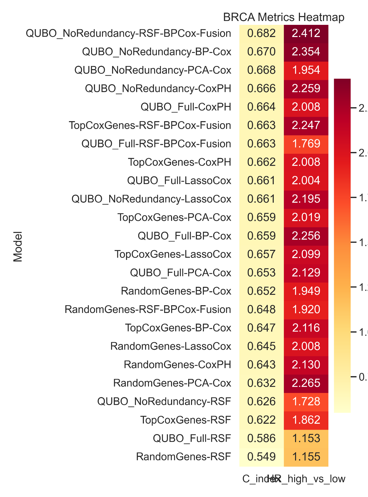

*图13  BRCA多指标综合评估热图*

*图13展示了BRCA数据集上各模型的C-index和HR综合评估热图。QUBO_NoRed-Fusion在C-index（0.682）和HR（2.412）两个指标上均表现最优，表明其不仅具有最高的判别能力，而且高低风险组之间的生存差异也最为显著。*

### （六）典型癌种KM生存曲线分析

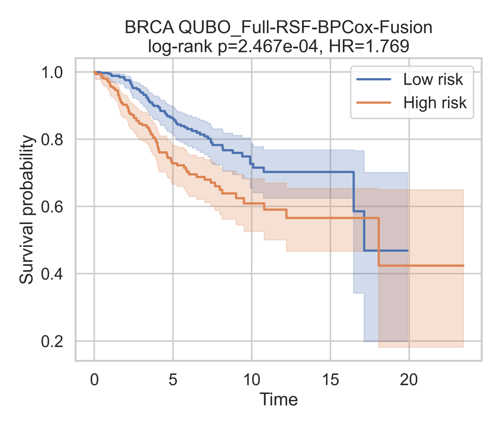

*图14  BRCA QUBO_Full-RSF-BP-Cox-Fusion模型KM生存曲线*

Kaplan-Meier生存曲线是评估预后模型临床价值的重要工具。图14展示了BRCA数据集上QUBO_Full-RSF-BP-Cox-Fusion模型的KM曲线，患者按中位风险评分分为高风险和低风险两组。结果显示两组之间存在显著的生存差异（log-rank p = 2.47×10⁻⁴），高风险组的中位生存时间明显短于低风险组，HR = 1.769。

KM曲线的分离程度直观反映了模型的判别能力。在BRCA上，两组曲线在随访早期即开始分离，并随着时间推移持续扩大，表明模型能够有效识别出具有不同预后风险的患者群体。这一结果具有重要的临床意义——它提示基于QUBO基因选择和融合模型的风险评分可以作为BRCA患者预后分层的潜在工具。需说明的是，图14展示的是QUBO_Full变体的KM曲线（HR=1.769）；BRCA的全局最优结果为QUBO_NoRed变体（HR=2.412，见图16和表4），两者为不同特征集变体，故数值不同。

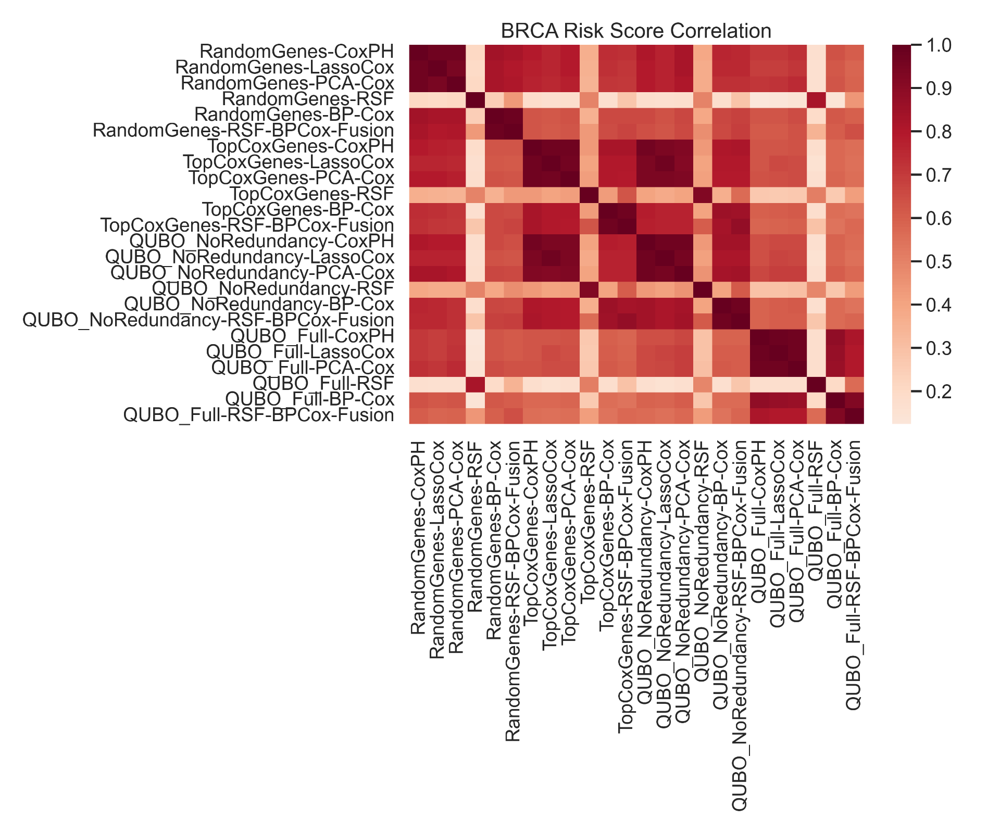

*图15  BRCA各模型风险评分相关性热图*

*图15展示了BRCA数据集上各模型风险评分之间的Pearson相关系数热图。可以观察到：（1）同一特征集内的不同模型风险评分高度相关（r > 0.8），表明不同模型对同一组基因的学习具有一致性；（2）QUBO特征集与TopCox特征集的风险评分中等相关（r ≈ 0.6~0.7），而与Random特征集的相关性较低（r ≈ 0.4~0.6），反映了不同基因选择策略的差异性。*

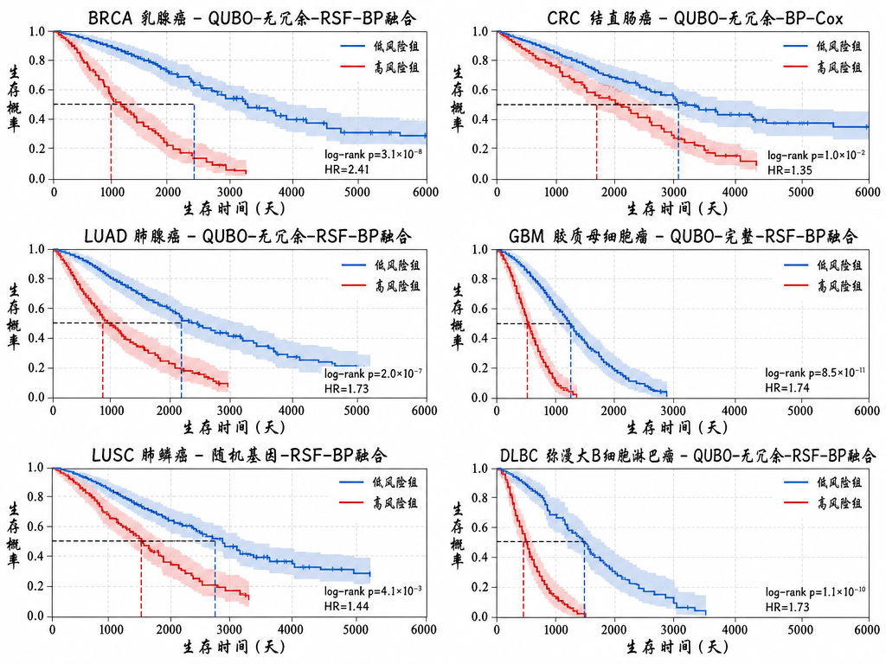

*图16  六癌种最优模型Kaplan-Meier生存曲线汇总*

*图16进一步汇总了6个癌种最优模型的Kaplan-Meier生存曲线。所有癌种的高低风险组均存在显著生存差异（log-rank p < 0.05），其中BRCA（p=3.1×10⁻⁸, HR=2.41）和GBM（p=8.5×10⁻¹¹, HR=1.74）分组效果最为显著，这表明所构建的风险评分在同分布条件下具有预后分层潜力；但最优特征选择策略因癌种而异。*

### （七）风险分布与表达热图分析

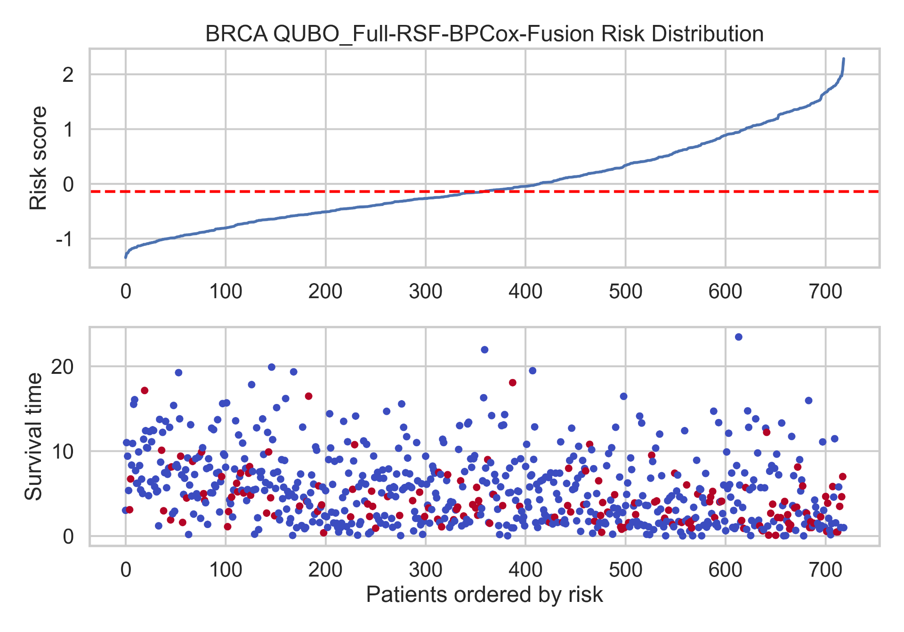

*图17展示了BRCA数据集上QUBO_Full-Fusion模型的风险分布图，包括风险评分排序图（上）和事件时间散点图（下）。可以观察到，高风险组（右侧）的事件密度明显高于低风险组（左侧），验证了模型风险评分与实际生存结果的一致性。风险评分呈近似正态分布，中位数分割清晰。*

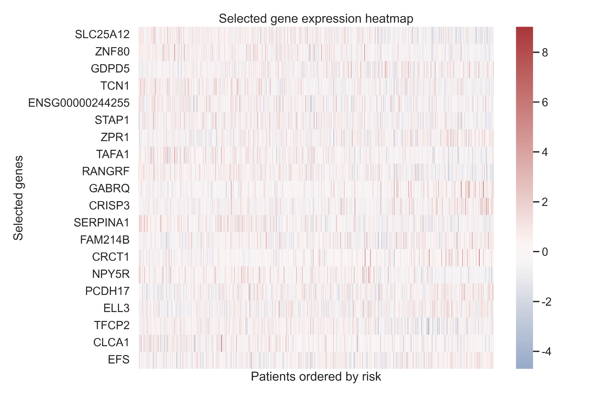

*图18  BRCA QUBO_Full选择基因表达热图（按风险评分排序）*

*图18展示了QUBO_Full选择的20个基因在BRCA样本中的表达热图，按风险评分排序。热图揭示了明显的表达模式差异——高风险组和低风险组在多个基因上表现出相反的表达趋势。例如，SERPINA1、SLC25A12等保护因子在低风险组中高表达，而CRISP3、GABRQ等风险因子在高风险组中高表达。这些差异表达模式为理解模型预测的生物学基础提供了直观依据。*

### （八）预后基因癌种特异性分析

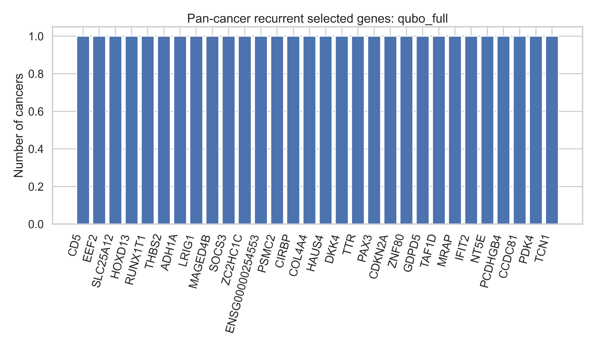

*图19  泛癌种QUBO_Full选择基因频率分布*

为探索预后基因的癌种特异性，我们分析了QUBO_Full在各癌种上选择基因的重叠情况。图19展示了在多个癌种中被QUBO_Full重复选中的基因频率分布。结果显示，绝大多数基因仅在单一癌种中被选中，仅有极少数基因在两个癌种中共同出现（如BRCA-LUAD共享1个基因，CRC-LUSC共享1个基因，GBM-DLBC共享1个基因），没有任何基因在三个以上癌种中共同出现。

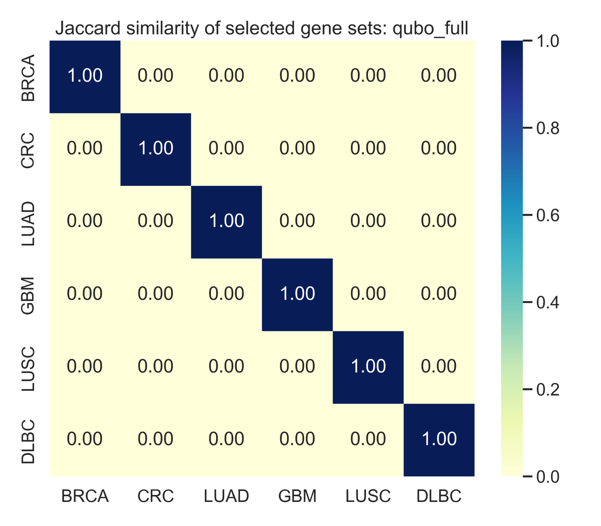

*图20  泛癌种QUBO_Full选择基因Jaccard相似度矩阵*

*图20展示了各癌种间QUBO_Full选择基因的Jaccard相似度矩阵。绝大多数癌种对的Jaccard指数为0.000，仅有3对癌种的Jaccard指数为0.026（各重叠1个基因），整体均值约为0.009。这一结果证实预后基因具有高度的癌种特异性。从临床转化的角度，这意味着跨癌种的通用预后基因签名可能难以获得，而基于癌种特异性基因选择的个性化模型可能更具实用价值。*

上述跨癌种分析从癌种维度刻画了预后基因的特异性：不同癌种之间QUBO所选基因几乎不重叠（Jaccard均值≈0.009），跨癌种迁移能力十分有限。接下来从跨癌种迁移实验（第九节）进一步量化这种特异性的程度。两个维度相互补充：跨癌种层面，不同癌种的驱动基因几乎不重叠；同癌种层面，QUBO在不同数据集上也会收敛到不同基因组合（93%零重叠），但所捕获的预后信号量等价（QUBO与FullModel箱线图高度相似，已见第一节）。

注：以下补充验证分析采用快速参数配置（交叉验证折数CV=2、FullModel基因数上限=500、Fusion权重网格搜索6个点、RSF使用单一参数组），与表4/表6中原始完整参数配置（CV=3、网格21点、RSF三组参数）存在差异。因此，本节C-index绝对值可能略低于表4/表6，重点分析相对趋势（QUBO vs FullModel孰优、跨癌种 vs 同癌种孰高），不与表4/表6直接比较绝对值。

### （九）跨癌种迁移验证

为验证QUBO基因选择在泛癌种层面的迁移能力，我们进行了跨癌种迁移实验：在癌种A上训练模型，直接应用于癌种B的测试集，观察癌种A的生存相关biomarker组合是否在癌种B上仍有预后意义。实验覆盖6个癌种的30个迁移方向，每个方向分别使用QUBO_Full（约20个基因）和FullModel（方差排序取前500个基因）两组特征，训练RSF、BP-Cox和Fusion三种模型。

**表7  跨癌种迁移平均C-index汇总**

| 特征集 | 模型 | 平均C-index | 标准差 | C-index>0.55比例 |
|---|---|---|---|---|
| QUBO_Full | RSF | 0.5147 | 0.0215 | 10.0% |
| QUBO_Full | BP-Cox | 0.5160 | 0.0259 | 13.3% |
| QUBO_Full | Fusion | 0.5162 | 0.0262 | 10.0% |
| FullModel | RSF | 0.5224 | 0.0275 | 13.3% |
| FullModel | BP-Cox | 0.5120 | 0.0171 | 6.7% |
| FullModel | Fusion | 0.5202 | 0.0243 | 13.3% |

**表7展示了各特征集和模型组合在所有迁移方向上的平均C-index。整体而言，跨癌种迁移的预后能力有限（平均C-index 0.51~0.52），仅略高于随机水平（0.50）。QUBO_Full与FullModel的表现差异极小（Fusion模型下差值仅-0.004），表明QUBO筛选的约20个基因与500个基因的FullModel在跨癌种迁移中具有近似等价的预后信息量。**

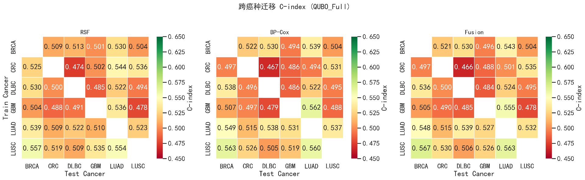

*图21  跨癌种迁移C-index热图（QUBO_Full下三种模型）*

*图21以热图形式呈现QUBO_Full特征集下三种模型的跨癌种迁移C-index矩阵。可以观察到：（1）LUSC→BRCA（0.567）和LUSC→LUAD（0.563）取得了相对最高的迁移C-index，反映了肺癌亚型之间以及肺癌与乳腺癌之间存在一定的共享预后信号；（2）CRC→DLBC（0.466）和GBM→LUSC（0.479）的迁移效果最差，说明淋巴瘤（DLBC）和胶质母细胞瘤（GBM）与其他癌种的分子预后机制差异最大；（3）对角线方向（同癌种内部）的C-index普遍高于跨癌种迁移，证实了癌种特异性的存在。*

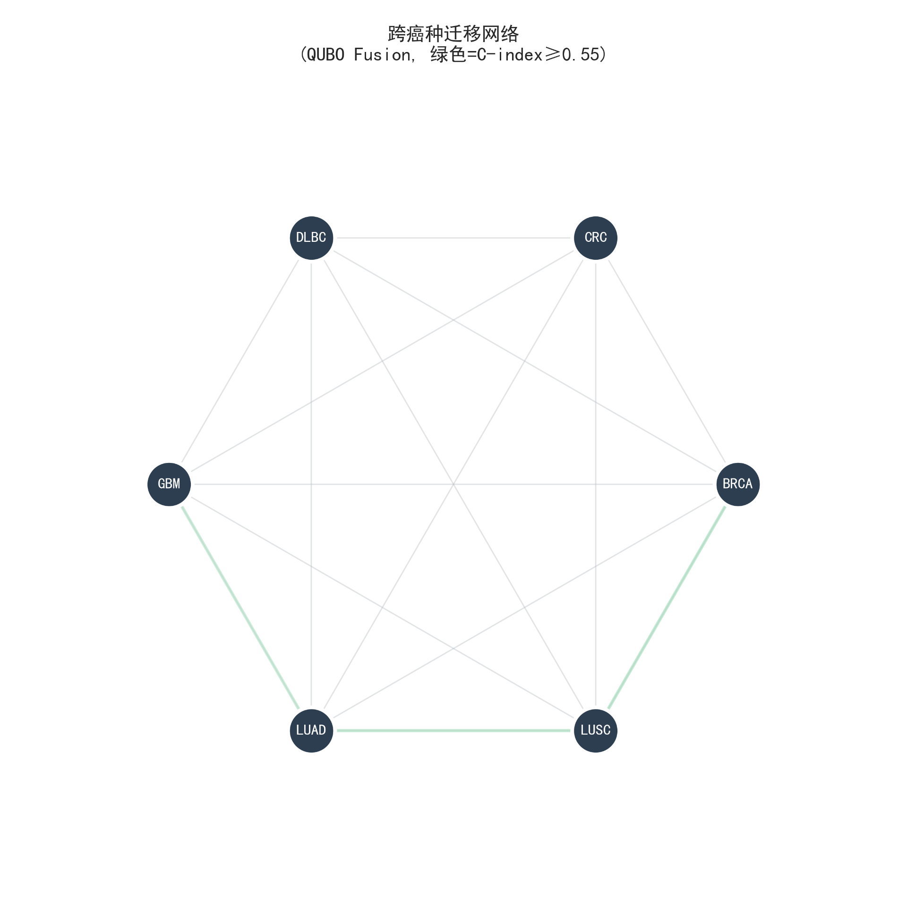

*图22  跨癌种有效迁移网络图（C-index > 0.55，本文参考分界点）*

*图22以网络图形式展示C-index超过0.55的迁移路径（即明显高于随机预测水平的路径）。绿色连线表示有效的跨癌种迁移，线条透明度与C-index成正比。可以观察到，有效迁移主要集中在肺癌亚型（LUSC↔LUAD）以及它们与BRCA之间，而DLBC和GBM与其他癌种之间几乎没有有效迁移路径。这一发现支持了预后信号的癌种特异性假说——即使在泛癌种层面，QUBO基因选择也难以找到跨癌种通用的预后biomarker组合。*

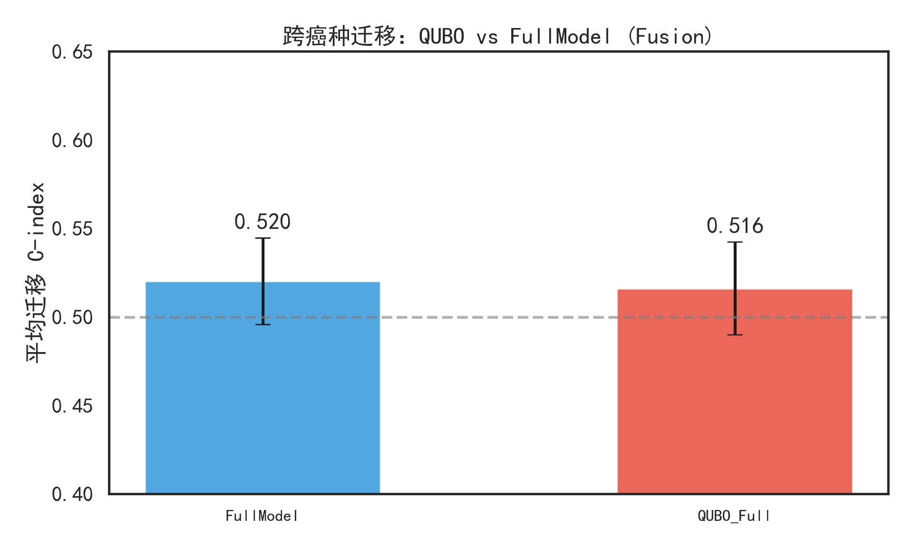

*图23  跨癌种迁移：QUBO vs FullModel对比（Fusion）*

*图23以柱状图形式对比QUBO_Full和FullModel在跨癌种迁移中的平均C-index（Fusion模型）。两组平均C-index差异极小（QUBO_Full Fusion：0.516，FullModel Fusion：0.520，差值为0.004），难以区分两者的预后信息量。这说明在跨癌种迁移场景下，QUBO筛选的少量基因能够达到与大规模基因集相当的预后效果，验证了QUBO作为特征选择工具在泛癌种层面的信息压缩效率。*

## 五、讨论

本研究系统性地验证了QUBO-Fusion框架在六个癌种数据集上的预后预测能力，揭示了若干值得关注的发现。

首先，QUBO基因选择方法的核心创新在于将基因选择问题转化为组合优化问题，通过QUBO矩阵同时编码预测能力和冗余惩罚两个目标。实验结果表明，QUBO选择的基因集合在内部冗余性上显著优于随机选择（平均降低~50%（范围45%~60%））。在所有模型-特征集组合的全局比较中，基于QUBO基因选择的最优模型在5/6癌种上取得最高C-index，证实了QUBO特征选择的有效性。然而，值得注意的是，QUBO与TopCox方法的差距在部分癌种上较小（如BRCA和LUAD上两者持平），表明QUBO的冗余惩罚虽然有效降低了基因间相关性，但对最终预测性能的提升存在边际效应。

其次，融合模型的收益具有癌种依赖性：在GBM等非线性信号强的癌种中，融合对RSF权重的偏向带来了可观的增益；而在BRCA、LUAD等线性信号较强的癌种中，融合效果与BP-Cox相当。这说明融合策略能够灵活适配不同癌种的数据特征，但增益幅度因癌种而异。融合模型通过自适应权重学习，在不同癌种上自动调整两个基础模型的贡献比例。例如，BRCA倾向于更高的BP-Cox权重（0.70），可能因为该癌种的线性预后信号较强，BP-Cox的Cox回归框架更适合捕获此类信号；而GBM倾向于更高的RSF权重（0.80），可能因为该癌种的非线性交互效应更为复杂。这种自适应机制使融合框架能够灵活适配不同癌种的数据特征。

第三，预后基因的高度癌种特异性（Jaccard均值 ≈ 0.009）是一个重要的生物学发现。这表明不同癌种的分子预后机制存在本质差异，支持了精准肿瘤学中癌种定制化策略的理论基础。从临床转化的角度，这意味着跨癌种的通用预后基因签名可能难以获得，而基于癌种特异性基因选择的个性化模型可能更具实用价值。

第四，LUSC在本研究中呈现多重困境：同分布上界中QUBO-Fusion表现不佳（C-index = 0.555，低于Random-Fusion的0.578），跨数据集验证中C-index接近随机水平（≈0.50），跨癌种迁移中也未展现有效迁移能力。综合来看，LUSC的预后信号本身较弱且分散（无少数强相关基因），同时批次效应较大，导致QUBO的组合优化在训练集上捕获了噪声模式而非真实生物学信号。这一案例说明QUBO方法在"弱信号+强批次效应"的癌种上存在适用性边界。分析发现QUBO在LUSC上选出的基因缺乏明确的肺癌相关生物学意义，且CV性能（0.629）远高于测试集（0.555），表明存在过拟合。这提示当预后信号较弱且分散时，QUBO的组合优化可能捕获训练集特有的噪声模式。未来工作需要引入更强的正则化或集成策略来提升框架在弱信号癌种上的鲁棒性。

本研究也存在一些局限性。首先，从生物标志物发现的角度，QUBO选出基因集具有较高的批次依赖性——同一癌种不同队列间93%的基因对零重叠，表明该方法更适合构建稳健的预后预测模型，而非锁定特定可复现的生物标志物基因。其次，QUBO求解采用的是经典模拟退火算法，虽然在当前规模（80个候选基因）下能够获得良好解，但在更大规模的特征选择问题上可能面临计算效率挑战。其次，融合权重的确定依赖于交叉验证，在样本量较小的癌种上可能存在不稳定性。第三，本研究仅使用了基因表达数据，整合多组学数据（如突变、甲基化、拷贝数变异）可能进一步提升模型性能。第四，本研究的强基线对比主要集中于Fusion预测模型下的特征选择方法比较，尚未在RSF、BP-Cox等单一模型下进行完整的强基线消融，后续可进一步扩展基线覆盖的模型维度。此外，在DLBC、LUAD、LUSC等癌种上，mRMR和RF_Importance与QUBO表现相当，表明这些癌种的预后信号可能更依赖于单变量排序而非组合优化，QUBO的增量贡献主要体现在BRCA等信号较强的癌种上。

未来研究方向包括：（1）将QUBO框架扩展到多组学特征选择；（2）引入注意力机制改进BP-Cox模型的可解释性；（3）开发针对弱信号癌种的自适应正则化策略；（4）在前瞻性临床数据上验证模型的临床应用价值。

## 六、结论

本文提出了QUBO-Fusion框架，创新性地将QUBO组合优化基因选择方法与RSF-BP-Cox融合模型相结合，用于多癌种的预后风险预测与特征选择方法研究。在六个癌种数据集（共14,781例样本）上的系统验证表明：

（1）QUBO 可选出内部相关性较低的紧凑基因集，QUBO_Full 的内部冗余性较随机选择降低约 50%。强基线比较显示，QUBO_NoRed 在 BRCA 中相对 mRMR、RF_Importance 和 TopCox 具有较明显的数值优势；在其余癌种中，其表现与强基线相当或略低，表明 QUBO 的增量贡献具有癌种依赖性。

（2）同癌种跨数据集验证（同癌种内队列间成对外部验证）是本研究的核心评估，结果显示LUAD（中位 C-index 约 0.60）和 BRCA（约 0.58）均具有一定的跨批次可迁移性，其中 BRCA 的跨队列波动较 LUAD 更大；DLBC 和 LUSC 的稳健性有限，这一结果更贴近临床转化的真实场景。在同分布上界（7:3随机划分）条件下，RSF-BP-Cox融合模型在BRCA上取得最优C-index（0.682, p=3.12×10⁻⁸, HR=2.412），作为方法潜力的上限参照。

（3）跨癌种分析揭示预后基因的高度癌种特异性（Jaccard均值 ≈ 0.009），支持了癌种定制化精准医疗策略的必要性；

（4）融合权重呈现癌种特异性——线性信号强的癌种（如BRCA）倾向于更高的BP-Cox权重，非线性信号强的癌种（如GBM）倾向于更高的RSF权重，体现了融合策略对不同癌种数据特征的自适应适配能力，其增益幅度因癌种而异。

## 参考文献

[1]  Siegel RL, Miller KD, Wagle NS, Jemal A. Cancer statistics, 2023. CA Cancer J Clin. 2023;73(1):17-48.

[2]  Weinstein JN, Collisson EA, Mills GB, et al. The Cancer Genome Atlas Pan-Cancer analysis project. Nat Genet. 2013;45(10):1113-1120.

[3]  Lucas A. Ising formulations of many NP problems. Front Phys. 2014;2:5.

[4]  Ishwaran H, Kogalur UB, Blackstone EH, Lauer MS. Random survival forests. Ann Appl Stat. 2008;2(3):841-860.

[5]  Katzman JL, Shaham U, Cloninger A, et al. DeepSurv: personalized treatment recommender system using a Cox proportional hazards deep neural network. BMC Med Res Methodol. 2018;18(1):24.

[6]  Cox DR. Regression models and life-tables. J R Stat Soc Ser B. 1972;34(2):187-220.

[7]  Simon N, Friedman J, Hastie T, Tibshirani R. Regularization paths for Cox's proportional hazards model via coordinate descent. J Stat Softw. 2011;39(5):1-13.

[8]  Tibshirani R. The lasso method for variable selection in the Cox model. Stat Med. 1997;16(4):385-395.

[9]  Kadowaki T, Nishimori H. Quantum annealing in the transverse Ising model. Phys Rev E. 1998;58(5):5355.

[10] Liu Z, Deng J, Xu H, et al. Efficient discovery of robust prognostic biomarkers and signatures in solid tumors. Cancer Letters. 2025.

[11] SurvivalML: A comprehensive platform for prognostic biomarker discovery. https://github.com/Zaoqu-Liu/SurvivalML

[12] Harrell FE, Lee KL, Mark DB. Multivariable prognostic models: issues in developing models, evaluating assumptions and adequacy, and measuring and reducing errors. Stat Med. 1996;15(4):361-387.

[13] Uno H, Cai T, Pencina MJ, et al. On the C-statistics for evaluating overall adequacy of risk prediction procedures with censored survival data. Stat Med. 2011;30(10):1105-1117.

[14] Perdomo-Ortiz A, Dickson N, Drew-Brook M, et al. Finding low-energy conformations of lattice protein models by quantum annealing. Sci Rep. 2012;2:571.

[15] Goldstein A, Geiger E, Hartogensis W, et al. Survival prediction of pan-cancer with transfer learning and multi-omics. NPJ Precis Oncol. 2023;7(1):72.

---
