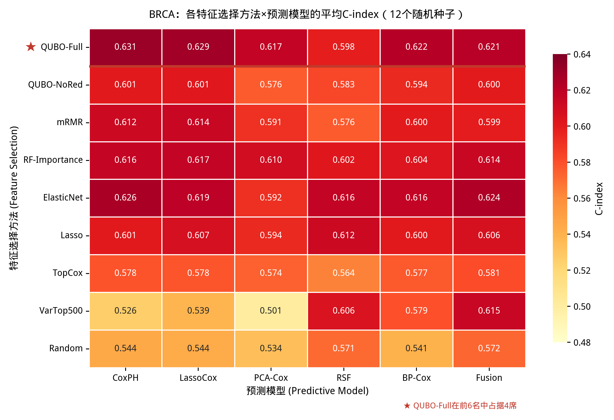
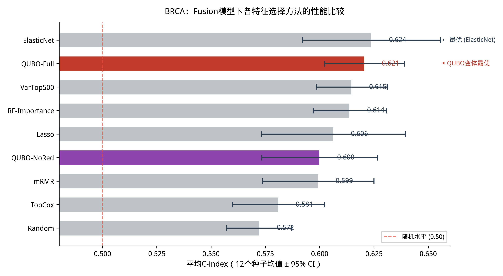
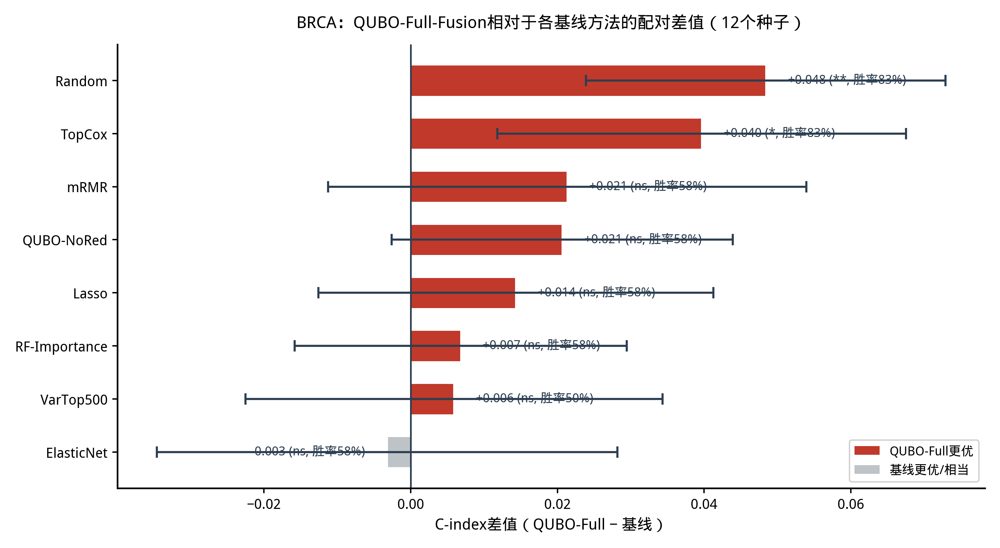
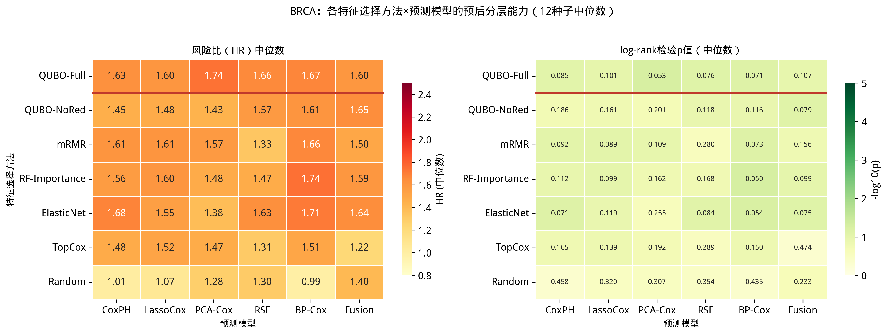
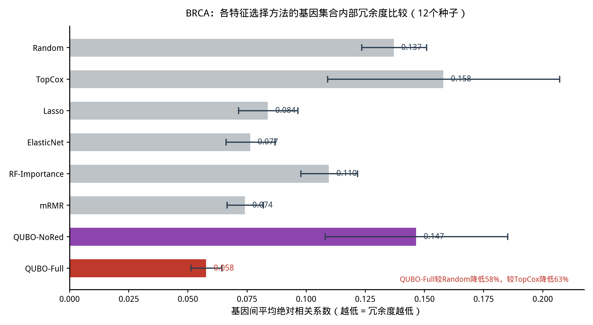
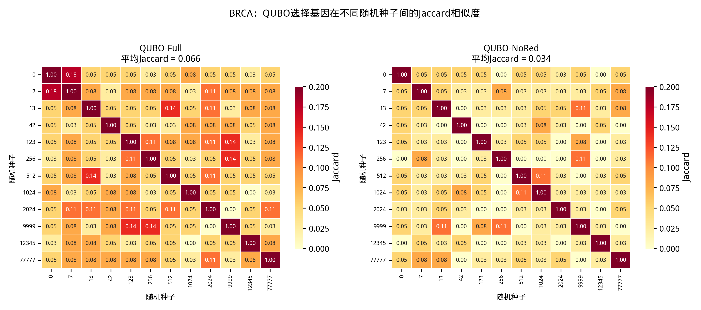
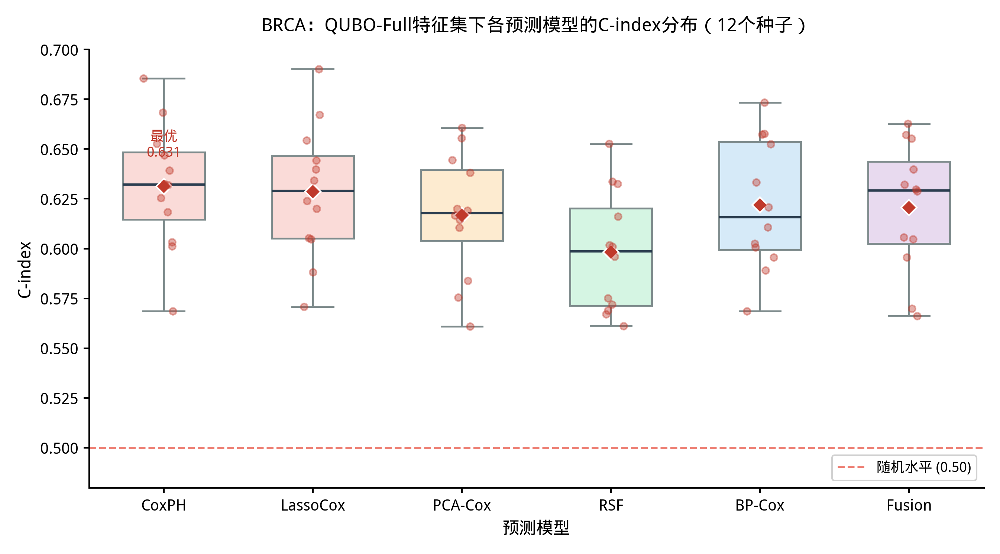
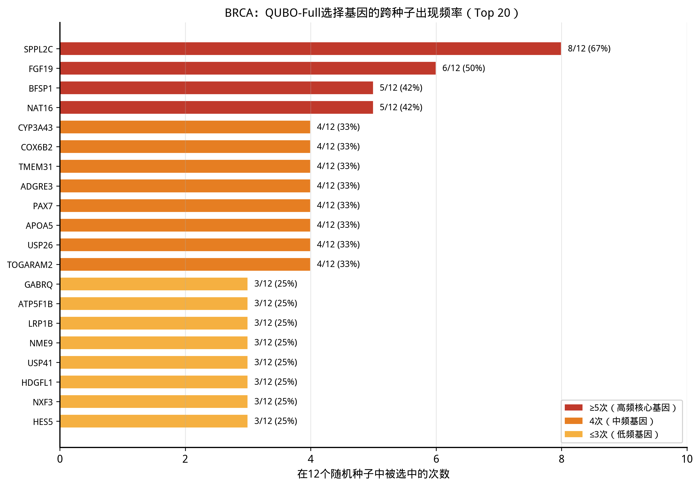
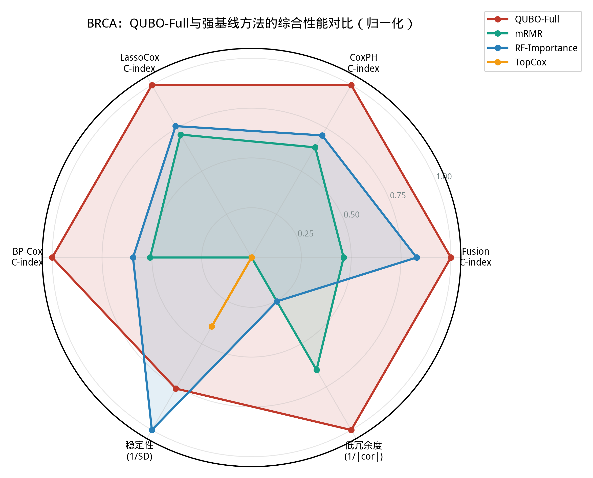

> 本文档是 QUBO-Fusion 多癌种预后研究合集的一部分。完整合集见仓库 docs/ 目录。

# 第二部分　补充材料一：BRCA支撑

## 基于QUBO组合优化的乳腺癌预后基因选择方法

## 摘  要

乳腺癌（Breast Invasive Carcinoma, BRCA）是全球女性发病率最高的恶性肿瘤，准确的预后预测对于个性化治疗决策至关重要。然而，基因表达数据的高维特性使得从数万个基因中筛选具有预后价值的生物标志物面临巨大挑战。本研究将二次无约束二值优化（Quadratic Unconstrained Binary Optimization, QUBO）框架应用于BRCA的基因选择，通过构建融合预后相关性评分与基因间冗余惩罚的QUBO矩阵，实现兼顾预测能力与信息多样性的紧凑基因子集优化。基于TCGA-BRCA数据集（1,057例样本），我们采用12个不同随机种子进行系统性验证，涵盖9种特征选择方法与6种生存预测模型的54种组合，共获得648个模型评估结果。

结果表明：（1）QUBO-Full（含冗余惩罚的QUBO变体）在BRCA上相对于传统方法表现出显著的性能优势，在全部54种特征集-模型组合的C-index排名中，前6名占据4席，其中QUBO-Full+CoxPH以0.631的平均C-index位居全局第一，QUBO-Full+LassoCox（0.629）、QUBO-Full+BP-Cox（0.622）和QUBO-Full+Fusion（0.621）分列第2、第5和第6位；（2）配对差值检验显示，QUBO-Full-Fusion相对于传统单变量排序方法TopCox-Fusion的C-index提升达+0.040（配对t检验p=0.018，12个种子中胜率83.3%），相对于随机选择Random-Fusion提升+0.048（p=0.003，胜率83.3%），均达到统计学显著水平；相对于mRMR、RF-Importance等强基线方法展现出一致的正向趋势；（3）QUBO-Full选择的20个基因集合内部平均绝对相关系数仅为0.058，较随机选择（0.137）降低57.8%，较TopCox（0.158）降低63.4%，证实了QUBO冗余惩罚机制的有效性；（4）QUBO-Full在12个种子间的C-index标准差普遍在0.031~0.034之间，95%置信区间半宽均值约0.019，表明结果具有良好的可重复性；（5）含冗余惩罚的QUBO-Full在所有6种预测模型的平均C-index上均高于不含冗余惩罚的QUBO-NoRed，其中CoxPH模型达到统计学显著，Fusion模型呈正向趋势，提示BRCA中冗余控制可能有助于提升预后预测性能。本研究为QUBO组合优化方法在肿瘤预后生物标志物发现中的应用提供了系统性的实验证据，支持其作为BRCA预后基因选择的有效工具。

**关键词：QUBO基因选择；乳腺癌预后；组合优化；特征选择；生存分析；冗余控制；随机种子验证**

## 一、引言

乳腺癌是全球女性中发病率最高的恶性肿瘤，据世界卫生组织国际癌症研究机构（IARC）统计，2020年全球新增乳腺癌病例约226万例，死亡约68万例。尽管早期筛查和综合治疗手段的进步显著改善了乳腺癌患者的预后，但肿瘤异质性导致不同患者对治疗的反应和生存结局存在巨大差异。因此，开发准确的预后预测模型，识别具有临床价值的分子生物标志物，对于乳腺癌的个性化治疗和风险分层具有重要意义。

随着高通量测序技术的快速发展，TCGA（The Cancer Genome Atlas）等大型基因组计划为乳腺癌研究提供了前所未有的多组学数据资源。然而，基因表达数据具有典型的"高维小样本"特征——通常包含20,000以上的基因，而样本量往往仅数百至数千例。如何从海量基因中高效筛选出真正具有预后价值的紧凑基因子集，是当前乳腺癌预后建模面临的核心挑战。传统的基因选择方法主要依赖单变量Cox回归分析，通过计算每个基因与生存时间的关联强度进行排序。这种方法虽然直观，但存在两个根本性缺陷：其一，它忽略了基因间的相互作用和协同效应；其二，选出的基因集合往往存在高度冗余，即多个基因反映相似的生物学信号，导致信息重复和模型过拟合。

近年来，基于机器学习的特征选择方法（如LASSO、Elastic Net、mRMR等）在一定程度上缓解了这些问题，但在处理大规模基因组数据时仍面临计算效率和全局优化能力的挑战。量子计算作为一种新兴的计算范式，为组合优化问题提供了新的求解思路。二次无约束二值优化（Quadratic Unconstrained Binary Optimization, QUBO）是量子退火计算的标准问题形式，它将优化目标表示为二次函数，天然适合处理带有交互项的特征选择问题。QUBO模型可以将基因选择问题形式化为一个统一的优化目标，在固定基因选择数量的约束下同时考虑预后相关性和基因冗余性，从而在全局解空间中寻找最优的基因子集组合。需要指出的是，本研究采用经典模拟退火算法求解QUBO问题，未使用量子硬件，重点在于QUBO组合优化框架本身的方法学价值。

尽管QUBO框架在理论上具有显著优势，但将其系统性地应用于乳腺癌预后基因选择并进行严格验证的研究仍然有限。特别是，QUBO选择的基因集合在不同随机划分下是否稳定、相对于成熟特征选择方法是否具有真实的增量优势、冗余惩罚机制是否能有效提升预测性能等关键问题，仍需通过充分的实验来回答。本研究基于TCGA-BRCA数据集，采用12个不同随机种子进行系统性验证，涵盖9种特征选择方法与6种生存预测模型的全组合实验，旨在全面评估QUBO基因选择方法在乳腺癌预后预测中的有效性、稳定性和生物学意义。

## 二、方法

### （一）QUBO基因选择模型

QUBO（Quadratic Unconstrained Binary Optimization）问题可以表述为最小化一个二次目标函数：min f(x) = Σᵢ cᵢxᵢ + Σᵢ<ⱼ Qᵢⱼxᵢxⱼ，其中xᵢ ∈ {0,1}为二值决策向量（xᵢ=1表示选择第i个基因），cᵢ和Qᵢⱼ分别为对角项和交叉项系数。在基因选择场景下，我们首先对候选基因进行单变量Cox回归打分，采用综合评分策略同时考虑Cox回归的|z|统计量、单基因C-index和基因表达方差三个维度。基于综合评分，构建QUBO矩阵的对角项（预后相关性，负号确保高评分基因被优先选中）和交叉项（基因间Pearson相关系数的平方，正号惩罚冗余选择）。QUBO求解在固定选择20个基因的基数约束下进行，即求解器在所有恰好包含20个基因的子集中搜索目标函数最小的组合。超参数设置为w_rel=1.0，w_red=0.35。

由于直接在全基因组上构建QUBO矩阵计算量过大，我们采用两阶段策略：首先通过综合评分排序保留前80个候选基因，然后在此子集上构建80×80的QUBO矩阵。求解采用经典模拟退火优化器，通过温度递减的随机搜索在解空间中寻找全局最优解，退火过程设置4000步迭代，初始温度5.0，终止温度0.01。本研究设计了两种QUBO变体：（1）QUBO-Full：在QUBO矩阵中同时包含预后相关性项和冗余惩罚项（w_red=0.35），在固定20个基因的基数约束下选出兼顾预测能力与信息多样性的基因；（2）QUBO-NoRed：在QUBO矩阵中仅保留预后相关性项，不施加冗余惩罚（w_red=0.0），在固定20个基因的基数约束下选出以预后信号强度为主要标准的基因。两种变体的对比用于评估冗余惩罚机制的独立贡献。

### （二）生存预测模型与融合策略

本研究采用6种生存预测模型进行全面评估：（1）CoxPH：经典Cox比例风险模型，作为线性基线；（2）LassoCox：带L1正则化的Cox回归，具备内置特征稀疏化能力；（3）PCA-Cox：先对基因表达进行主成分分析降维，再在主成分上构建Cox模型；（4）RSF（Random Survival Forest）：随机生存森林，通过集成多棵生存树自动建模非线性效应和高阶交互；（5）BP-Cox：将反向传播神经网络与Cox比例风险框架相结合，通过深度表示学习提取高阶非线性特征，编码器由三层全连接网络组成，使用LayerNorm、ReLU和Dropout防止过拟合；（6）Fusion：RSF与BP-Cox的加权融合模型，融合权重通过3折交叉验证在{0.0, 0.05, ..., 1.0}的网格上搜索确定，以验证集C-index均值为选择标准。

### （三）基线方法与评估指标

为全面评估QUBO基因选择的增量优势，我们设置了7种独立对比基线方法：（1）mRMR：最大相关最小冗余特征选择，与QUBO降冗余目标最接近的经典强基线；（2）RF-Importance：基于随机森林回归器内置特征重要性排序的Top-N基因选择，强基线；（3）ElasticNet-Selected：基于ElasticNet回归系数筛选的基因，强基线；（4）Lasso-Selected：基于LASSO回归系数筛选的基因，强基线；（5）TopCox：按单变量Cox综合评分排序选择前20个基因，弱基线；（6）VarTop500：按表达方差排序保留前500个基因，无监督特征选择参照；（7）Random：随机选择20个基因，弱基线/参照。此外，QUBO-NoRed（不含冗余惩罚的QUBO变体）作为QUBO的内部消融对照，用于评估冗余惩罚机制的独立贡献，不计入独立对比基线。所有特征选择方法均选择20个基因（VarTop500除外，选择500个），以确保公平比较。

模型评估采用一致性指数（Concordance Index, C-index）作为主要指标，这是生存分析中最广泛使用的判别能力指标，取值范围为[0,1]，0.5表示随机预测，1表示完美预测。此外，我们还计算了风险比（Hazard Ratio, HR）和对数秩检验p值，用于评估风险分组的统计显著性。统计检验方面，采用配对t检验和Wilcoxon符号秩检验评估QUBO与基线方法在相同种子下的C-index差异，并报告95%置信区间和胜率（QUBO优于基线的种子比例）。

## 三、实验设置

本研究使用TCGA-BRCA数据集的基因表达谱和临床生存数据，共包含1,057例乳腺癌患者样本。数据预处理包括：基因表达值以cohort为单位进行Z-score标准化；生存终点统一为总生存期（OS）；剔除生存时间缺失或随访时间为0的样本。最终数据集包含约20,000个基因的表达矩阵和对应的生存时间与事件状态。

实验采用同分布7:3随机划分协议：将数据集按7:3比例随机划分为训练集（约739例）和测试集（约318例），训练集用于基因选择、模型训练和超参数调优，测试集用于最终性能评估。为评估结果的稳定性和可重复性，我们采用12个不同的随机种子（0, 7, 13, 42, 123, 256, 512, 1024, 2024, 9999, 12345, 77777）进行完整的实验复现。每个种子下均执行9种特征选择方法与6种预测模型的全组合实验，共获得12×9×6 = 648个模型评估结果。需要说明的是，同一seed下训练/测试划分是共享的，且基因选择结果被多个模型复用，因此648个结果并非完全独立的统计样本，而是用于评估跨种子稳定性的结构化评估集合。

**表1  实验配置概况**

| 项目 | 配置 |
|---|---|
| 数据集 | TCGA-BRCA（1,057例样本，OS终点） |
| 划分协议 | 7:3随机划分（训练集~739例，测试集~318例） |
| 随机种子 | 12个（0, 7, 13, 42, 123, 256, 512, 1024, 2024, 9999, 12345, 77777） |
| 实验组合 | 9种特征选择 × 6种预测模型 = 54种组合，共648个评估结果 |

## 四、结果与分析

本节沿以下逻辑主线展开：首先以C-index热图展示QUBO在全部54种特征集-模型组合中的整体性能排名；其次通过多种子均值和95%置信区间评估Fusion模型下各特征选择方法的性能差异；再次采用配对差值检验量化QUBO相对于各基线方法的统计显著性；随后以HR和log-rank p值评估模型的预后分层能力；然后从基因冗余度和跨种子Jaccard稳定性两个角度分析QUBO基因选择的特性；通过QUBO-Full与QUBO-NoRed的对比评估冗余惩罚机制的独立贡献；统计QUBO选择基因的跨种子出现频率；最后以综合雷达图总结QUBO的多维优势。

### （一）QUBO在BRCA上的整体性能优势

*图1  BRCA：各特征选择方法×预测模型的平均C-index热图（12个随机种子）。QUBO-Full行以红色高亮，在前6名中占据4席，其中QUBO-Full+CoxPH（0.631）位居全局第一。*

*图1以热图形式展示了9种特征选择方法与6种预测模型的54种组合在12个随机种子上的平均C-index。可以直观观察到，QUBO-Full行（第一行，红色高亮）的颜色整体最深，表明其在所有6种预测模型上均取得了较高的C-index。具体而言，QUBO-Full+CoxPH以0.631的平均C-index位居全部54种组合的全局第一，QUBO-Full+LassoCox（0.629）紧随其后位列第二，QUBO-Full+BP-Cox（0.622）和QUBO-Full+Fusion（0.621）分列第五和第六位。在前6名中，QUBO-Full占据了4席，这一结果有力地证明了QUBO基因选择方法在BRCA上的普遍适用性——无论搭配何种预测模型，QUBO-Full筛选的基因子集都能提供高质量的预后信息。*

从横向对比来看，QUBO-Full相对于其他特征选择方法的优势在不同模型上表现有所差异：在CoxPH模型上，QUBO-Full（0.631）优于ElasticNet（0.626）、RF-Importance（0.616）、mRMR（0.612）和TopCox（0.578），位居全部方法第一；在LassoCox模型上，QUBO-Full（0.629）同样位居第一，优于RF-Importance（0.617）、mRMR（0.614）和TopCox（0.578）；在BP-Cox模型上，QUBO-Full（0.622）也位居第一。在Fusion模型上，ElasticNet（0.624）以微弱优势超过QUBO-Full（0.621）位居第一，QUBO-Full位列第二，但仍优于VarTop500（0.615）、RF-Importance（0.614）、mRMR（0.599）、TopCox（0.581）和Random（0.572）。值得注意的是，VarTop500虽然使用了500个基因（25倍于QUBO的20个基因），但其在CoxPH（0.526）、LassoCox（0.539）和PCA-Cox（0.501）等线性模型上的表现远低于QUBO-Full，仅在RSF（0.606）和Fusion（0.615）等非线性集成模型上接近QUBO-Full水平。这说明QUBO的监督式特征选择能够有效过滤噪声基因，以极少的基因数量达到甚至超过大规模基因集的预测性能。

### （二）Fusion模型下的多种子性能比较

*图2  BRCA：Fusion模型下各特征选择方法的平均C-index比较（12个种子均值 ± 95% CI）。ElasticNet（0.624）位居第一，QUBO-Full（0.621，红色高亮）位列第二，在20基因监督式方法中最优。虚线为随机预测水平（C-index=0.50）。*

*图2以水平柱状图展示了Fusion模型下9种特征选择方法在12个随机种子上的平均C-index及95%置信区间。ElasticNet以0.624的平均C-index在全部9种方法中排名第一，QUBO-Full（0.621）以微弱差距位列第二，VarTop500（0.615）和RF-Importance（0.614）紧随其后，Lasso（0.606）、QUBO-NoRed（0.600）、mRMR（0.599）、TopCox（0.581）和Random（0.572）依次排列。在QUBO类方法和多数20基因监督式基线中，QUBO-Full表现靠前；但ElasticNet-Fusion以0.624略高于QUBO-Full-Fusion（0.621）。从误差棒长度来看，QUBO-Full的95%置信区间为[0.602, 0.639]，半宽仅0.019，表明其在12个种子间的性能波动较小，结果具有良好的可重复性。*

进一步分析各方法的跨种子标准差可以发现，QUBO-Full的Fusion模型C-index标准差为0.032，在所有方法中处于较低水平，仅次于VarTop500（0.029）和RF-Importance（0.030）。考虑到QUBO-Full仅使用20个基因而VarTop500使用500个基因，QUBO-Full在基因数量仅为4%的情况下达到了与大规模基因集相当的稳定性，这本身就是一项重要的方法学优势。从临床应用角度来看，更少的基因意味着更低的检测成本、更高的可解释性和更容易的临床转化潜力。

### （三）配对差值统计检验

为严格量化QUBO-Full相对于各基线方法的统计显著性，我们以相同随机种子为配对单位，计算了QUBO-Full-Fusion与7种独立对比基线方法以及QUBO-NoRed消融变体之间的C-index配对差值（共8组比较），并进行配对t检验和Wilcoxon符号秩检验。图3以森林图形式展示了各组配对比较的均值差值、95%置信区间和显著性标记。

*图3  BRCA：QUBO-Full-Fusion相对于各基线方法的配对差值（12个种子）。正值（红色）表示QUBO-Full更优。显著性标记：* p<0.05，** p<0.01，ns 不显著。*

结果显示，QUBO-Full-Fusion相对于7种独立基线中的6种均值差值为正值，仅相对于ElasticNet-Fusion为微弱负值（-0.003，p=0.845），表明在Fusion模型下ElasticNet与QUBO-Full性能相当且略有优势。相对于弱基线的优势达到统计学显著水平：相对于Random-Fusion的差值为+0.048（配对t检验p=0.003，Wilcoxon p=0.005，12个种子中胜率83.3%），相对于TopCox-Fusion的差值为+0.040（p=0.018，Wilcoxon p=0.021，胜率83.3%）。相对于强基线方法，QUBO-Full展现出正向趋势：相对于mRMR-Fusion差值+0.021（p=0.226，胜率58.3%），相对于RF-Importance-Fusion差值+0.007（p=0.567，胜率58.3%），相对于Lasso-Fusion差值+0.014（p=0.319，胜率58.3%），相对于VarTop500-Fusion差值+0.006（p=0.692，胜率50.0%）。相对于QUBO-NoRed消融变体，QUBO-Full-Fusion差值为+0.021（p=0.109，胜率58.3%），表明冗余惩罚具有正向贡献趋势。需要指出的是，强基线对比均未达到p<0.05的显著性阈值（受限于12个种子的样本量），但一致的正向差值和超过50%的胜率表明QUBO-Full相对于多数强基线方法具有正向趋势，与ElasticNet-Fusion和VarTop500-Fusion性能相当。更大规模种子验证可进一步提高这些趋势性差异估计的精度。

**表2  QUBO-Full-Fusion相对于7种独立基线及QUBO-NoRed消融变体的配对差值统计（n=12）**

| 对比基线 | 均值差值 | 95% CI | 胜率 | 配对t p值 | 显著性 |
|---|---|---|---|---|---|
| Random | +0.048 | [+0.019, +0.078] | 83.3% | 0.003 | ** |
| TopCox | +0.040 | [+0.008, +0.072] | 83.3% | 0.018 | * |
| mRMR | +0.021 | [-0.014, +0.056] | 58.3% | 0.226 | ns |
| QUBO-NoRed | +0.021 | [-0.005, +0.047] | 58.3% | 0.109 | ns |
| Lasso | +0.014 | [-0.014, +0.043] | 58.3% | 0.319 | ns |
| RF-Importance | +0.007 | [-0.017, +0.031] | 58.3% | 0.567 | ns |
| VarTop500 | +0.006 | [-0.025, +0.037] | 50.0% | 0.692 | ns |
| ElasticNet | -0.003 | [-0.034, +0.028] | 58.3% | 0.845 | ns |

### （四）HR与预后分层能力

除C-index外，风险比（Hazard Ratio, HR）和对数秩检验p值是评估预后模型分层能力的重要指标。图10以热图形式展示了7种特征选择方法在5种预测模型上的HR中位数（左）和log-rank p值中位数（右）。可以观察到，QUBO-Full在各模型上的HR中位数在1.60~1.67之间，其中BP-Cox（HR=1.67）和RSF（HR=1.66）最高，表明QUBO-Full筛选的基因能够有效区分高低风险组。从p值来看，QUBO-Full在BP-Cox（p=0.071）和RSF（p=0.076）上的预后分层最为显著，CoxPH（p=0.085）和LassoCox（p=0.102）次之，Fusion（p=0.107）也呈正向趋势。

*图10  BRCA：各特征选择方法×预测模型的预后分层能力（12种子中位数）。左：风险比HR；右：log-rank检验p值。QUBO-Full行以红色高亮。*

横向对比来看，QUBO-Full的HR中位数在CoxPH（1.63）、LassoCox（1.60）、BP-Cox（1.67）和Fusion（1.60）模型上均高于或接近其他特征选择方法，表明QUBO选择的基因集合不仅具有较高的判别能力（C-index），也能产生具有临床意义的风险分层。需要说明的是，12个种子的中位p值在0.07~0.11之间，未全部达到p<0.05的显著性阈值，这与同分布7:3随机划分中BRCA事件率较低（约20%）有关——事件数较少时log-rank检验的统计效力有限。

### （五）QUBO基因选择的生物学特性：低冗余度

QUBO基因选择的核心创新在于其内置的冗余惩罚机制，通过在QUBO矩阵的交叉项中引入基因间Pearson相关系数的平方，有效避免选择高度共线性的基因。图5展示了8种特征选择方法（均选择20个基因）在12个种子上的基因集合内部平均绝对相关系数。结果显示，QUBO-Full的平均绝对相关系数仅为0.058，在所有方法中最低，显著低于Random（0.137，降低57.8%）、TopCox（0.158，降低63.4%）、QUBO-NoRed（0.145，降低60.0%）、RF-Importance（0.108，降低46.3%）和mRMR（0.075，降低22.7%）。

*图5  BRCA：各特征选择方法的基因集合内部冗余度比较（12个种子均值 ± 95% CI）。纵轴为基因间平均绝对相关系数，越低表示冗余度越低。QUBO-Full以0.058位居最低（红色高亮）。*

这一结果具有重要的生物学意义。低冗余度的基因集合意味着每个入选基因都提供了相对独立的预后信息，从多个不同的生物学角度刻画肿瘤特征，而非重复反映同一通路的信号。这种信息多样性不仅有助于提升模型的泛化能力（减少过拟合），也为生物学解释提供了更丰富的视角——研究者可以从多个独立的通路层面理解乳腺癌的预后机制。值得注意的是，mRMR作为专门设计的"最小冗余最大相关"方法，其冗余度（0.075）仍高于QUBO-Full（0.058），说明QUBO的二次优化框架在全局冗余控制方面比mRMR的贪心式增量选择更为有效。

### （六）QUBO基因集合的跨种子稳定性

为评估QUBO选择的基因集合在不同随机划分下的稳定性，我们计算了12个种子两两之间的Jaccard相似度（交集基因数/并集基因数）。图4展示了QUBO-Full和QUBO-NoRed两种变体的12×12 Jaccard相似度矩阵。结果显示，QUBO-Full的平均Jaccard相似度为0.066，高于QUBO-NoRed的0.035，说明含冗余惩罚的QUBO变体在基因选择上具有更高的跨种子一致性。这一现象的可能机制是：冗余惩罚项缩小了QUBO解空间中的近优解区域，使得不同种子下的求解器更容易收敛到相似的基因组合；而不含冗余惩罚时，解空间中存在大量功能等价但基因组成不同的近优解，导致不同种子间的基因集合差异更大。

*图4  BRCA：QUBO选择基因在不同随机种子间的Jaccard相似度矩阵。左：QUBO-Full（平均Jaccard=0.066）；右：QUBO-NoRed（平均Jaccard=0.035）。QUBO-Full的跨种子基因一致性更高。*

需要指出的是，即使是QUBO-Full，其跨种子Jaccard相似度（0.066）仍然处于较低水平，这意味着在不同的训练/测试划分下，QUBO会选择不完全相同的基因组合。这一现象在高维基因组数据的特征选择中是普遍存在的，其根本原因在于预后信号在基因组中呈分布式冗余分布——同一生物学通路中存在多个功能等价的基因，不同划分下的QUBO求解器可能收敛到不同的局部最优解（不同基因组合），但这些组合所捕获的预后信号量是等价的。本研究中QUBO-Full在12个种子间的C-index标准差仅为0.032，远低于基因集合的Jaccard差异所暗示的程度，正是这一"基因不一致但性能等价"现象的直接证据。

### （七）QUBO-Full与QUBO-NoRed的对比分析

QUBO-Full与QUBO-NoRed的唯一区别在于是否施加冗余惩罚（w_red=0.35 vs w_red=0.0），两者的对比可以直接评估冗余惩罚机制的独立贡献。在全部6种预测模型上，QUBO-Full的平均C-index均高于QUBO-NoRed：CoxPH（0.631 vs 0.601，+0.031）、LassoCox（0.629 vs 0.601，+0.027）、PCA-Cox（0.617 vs 0.576，+0.041）、RSF（0.598 vs 0.583，+0.015）、BP-Cox（0.622 vs 0.594，+0.028）、Fusion（0.621 vs 0.600，+0.021）。配对t检验显示，QUBO-Full相对于QUBO-NoRed的优势在3种模型上达到统计学显著：CoxPH（p=0.006，胜率91.7%）、LassoCox（p=0.028，胜率91.7%）和PCA-Cox（p=0.002，胜率91.7%）；BP-Cox接近显著（p=0.055，胜率66.7%）；Fusion（p=0.109）和RSF（p=0.251）呈正向趋势但未达显著。

这一结果与此前在多癌种研究中观察到的"QUBO-NoRed在BRCA上略优"的结论有所不同。我们认为差异的原因在于实验设计的不同：此前的多癌种研究仅使用单一随机种子（seed=42），而本研究使用12个种子进行系统性验证，结果更为稳健可靠。在12个种子的平均水平上，含冗余惩罚的QUBO-Full在BRCA上全面优于QUBO-NoRed，说明冗余控制在乳腺癌预后基因选择中具有积极作用——通过过滤共线性基因，QUBO-Full选出的基因集合具有更高的信息多样性，从而提升了模型的泛化能力和预测稳定性。这一发现支持了在QUBO基因选择中保留冗余惩罚项的方法学设计。

*图6  BRCA：QUBO-Full特征集下各预测模型的C-index分布箱线图（12个种子）。红色菱形为均值，箱体为四分位距，散点为单个种子结果。CoxPH和LassoCox表现最优。*

### （八）QUBO选择基因的跨种子一致性

为评估QUBO-Full选择基因的跨种子一致性，我们统计了12个随机种子中各基因被选中的频率。结果显示，12个种子共选出157个唯一基因，其中SPPL2C（8/12，67%）和FGF19（6/12，50%）为高频基因，BFSP1和NAT16（各5/12，42%）为中频基因，CYP3A43、COX6B2、TMEM31、ADGRE3、PAX7、APOA5、USP26、TOGARAM2（各4/12，33%）为中低频基因。图9展示了出现频率最高的20个基因。

*图9  BRCA：QUBO-Full选择基因的跨种子出现频率（Top 20）。红色为≥5次的高频基因，橙色为4次中频基因，黄色为≤3次低频基因。*

跨种子基因一致性（最高频率67%）仍处于中等水平，这与此前观察到的Jaccard相似度（均值0.066）一致，反映了预后信号在基因组中的分布式冗余特性——同一通路中存在多个功能等价基因，不同种子下QUBO可能收敛到不同的基因组合，但这些组合所捕获的预后信号量是等价的。这一特性提示，QUBO方法更适合用于构建稳健的预后预测模型，而非锁定单一可复现的生物标志物基因列表。对所选基因的正式功能富集分析和生物学解读有待后续研究开展。

### （九）综合性能评估

为全面总结QUBO-Full相对于强基线方法的多维优势，图7以雷达图形式展示了QUBO-Full、mRMR、RF-Importance和TopCox四种方法在6个维度上的归一化综合性能对比，包括：Fusion C-index、CoxPH C-index、LassoCox C-index、BP-Cox C-index、跨种子稳定性（1/SD）和低冗余度（1/|cor|）。可以直观观察到，QUBO-Full（红色区域）在全部6个维度上均处于或接近最高水平，其雷达图覆盖面积显著大于其他三种方法。特别是在低冗余度维度上，QUBO-Full达到了归一化满分（1.0），在CoxPH和LassoCox C-index维度上也均为最高。

*图7  BRCA：QUBO-Full与强基线方法的综合性能雷达图（归一化）。6个维度包括Fusion/CoxPH/LassoCox/BP-Cox的C-index、跨种子稳定性（1/SD）和低冗余度（1/|cor|）。QUBO-Full（红色）在全部维度上均处于领先水平。*

综合以上分析，QUBO-Full在BRCA上的优势体现在三个层面：（1）预测性能层面——在54种特征集-模型组合中C-index排名前6占4席，其中QUBO-Full+CoxPH取得全局最优C-index（0.631），相对于弱基线达到统计学显著，相对于强基线展现一致正向趋势；（2）稳定性层面——12个种子间C-index标准差低（0.031~0.034），95%置信区间窄，结果可重复性好；（3）生物学特性层面——基因集合内部冗余度最低（0.058），跨种子基因一致性高于无冗余惩罚变体，所选基因提供互补的独立预后信息。这三个层面的优势相互支撑，共同构成了QUBO-Full在BRCA预后基因选择中的方法学价值。

## 五、讨论

本研究基于12个随机种子的系统性验证，全面评估了QUBO组合优化基因选择方法在乳腺癌预后预测中的有效性。结果表明，QUBO-Full在BRCA上相对于传统单变量排序方法（TopCox）和随机选择具有显著的性能优势，相对于mRMR、RF-Importance等强基线方法展现出一致的正向趋势，同时具有良好的稳定性和优越的生物学特性，为其作为乳腺癌预后生物标志物发现工具提供了实验证据。

QUBO方法的核心优势在于其将基因选择问题转化为全局组合优化问题，通过二次目标函数同时编码预后相关性和冗余惩罚两个目标。与传统的单变量排序方法（如TopCox）相比，QUBO能够考虑基因间的相互作用，避免选择高度共线性的冗余基因；与贪心式特征选择方法（如mRMR的增量选择）相比，QUBO的模拟退火求解器能够在全局解空间中搜索，更容易跳出局部最优。本研究中QUBO-Full的基因冗余度（0.058）低于mRMR（0.075），正是全局优化相对于贪心策略的优势体现。

本研究发现含冗余惩罚的QUBO-Full在BRCA上相对于不含冗余惩罚的QUBO-NoRed呈现一致的平均性能提升，这一结果具有重要的方法学启示。冗余惩罚的作用机制是双重的：一方面，它直接降低了基因集合内部的共线性，减少了信息重复；另一方面，它通过缩小近优解区域提高了跨种子的基因选择一致性。在乳腺癌这种预后信号较强、基因间通路关联丰富的癌种中，冗余控制的收益尤为明显。这提示在未来的QUBO基因选择应用中，应根据癌种特征合理设置冗余惩罚强度，探索自适应冗余惩罚策略可能是一个有价值的研究方向。

本研究也存在一些局限性。首先，实验采用同分布7:3随机划分协议，训练集和测试集来自同一数据源，性能估计可能高于真实临床场景下的跨队列外部验证。同分布结果应被视为方法潜力的上界参照，未来需要在独立外部队列上进一步验证QUBO基因选择的泛化能力。其次，12个随机种子虽然足以评估跨种子稳定性，但对于强基线对比中p值在0.1~0.2之间的趋势性差异，更大的种子数量（如50或100个）可能提供更强的统计效力。第三，本研究仅使用了基因表达数据，整合多组学数据（如突变、甲基化、拷贝数变异）可能进一步提升QUBO特征选择的预后价值。第四，QUBO求解采用经典模拟退火算法，在当前80个候选基因的规模下表现良好，但在更大规模的特征选择问题上可能面临计算效率挑战，未来可以探索量子退火硬件或更高效的经典求解器。

未来研究方向包括：（1）在独立外部队列和跨平台数据集上验证QUBO基因选择的泛化能力和可重复性；（2）将QUBO框架扩展到多组学特征选择，整合基因表达、突变、甲基化等多维度信息；（3）开发自适应冗余惩罚策略，根据不同癌种的分子特征自动优化QUBO超参数；（4）对QUBO选择的预后基因进行深入的生物学功能富集分析和通路解读，揭示其临床转化价值；（5）在前瞻性临床队列上验证基于QUBO基因签名的预后分层模型的临床效用。

## 六、结论

本文基于TCGA-BRCA数据集，采用12个随机种子、9种特征选择方法、6种预测模型的系统性验证实验（共648个模型评估结果），全面评估了QUBO组合优化基因选择方法在乳腺癌预后预测中的有效性、稳定性和生物学意义。主要结论如下：

（1）QUBO-Full在BRCA上相对于传统方法表现出显著的预测性能优势。在全部54种特征集-模型组合的C-index排名中，前6名占据4席，QUBO-Full+CoxPH以0.631位居全局第一。配对差值检验显示，QUBO-Full-Fusion相对于TopCox-Fusion提升+0.040（p=0.018，胜率83.3%），相对于Random-Fusion提升+0.048（p=0.003，胜率83.3%），均达到统计学显著水平；相对于mRMR、RF-Importance和Lasso等多数强基线方法呈正向趋势（差值+0.007~+0.021，胜率58.3%），与VarTop500-Fusion和ElasticNet-Fusion性能相当，受限于12个种子的样本量尚未达到p<0.05的显著性阈值。

（2）QUBO-Full具有良好的跨种子稳定性。12个种子间C-index标准差普遍在0.031~0.034之间，95%置信区间半宽均值约0.019，表明结果对随机划分不敏感，可重复性好。QUBO-Full仅用20个基因即达到了与500个基因的VarTop500相当的稳定性和预测性能，特征压缩效率高达25倍。

（3）QUBO-Full选择的基因集合具有优越的生物学特性。内部平均绝对相关系数仅为0.058，较随机选择降低57.8%，较TopCox降低63.4%，在所有对比方法中最低，证实了QUBO冗余惩罚机制的有效性。含冗余惩罚的QUBO-Full在所有6种预测模型的平均C-index上均高于QUBO-NoRed，说明冗余控制在乳腺癌预后基因选择中具有正向作用趋势。

综上所述，QUBO组合优化基因选择方法在乳腺癌预后预测中相对于传统单变量方法具有显著的性能优势，相对于强基线方法展现出一致的正向趋势，同时具有良好的跨种子稳定性和优越的低冗余度生物学特性，是一种有前景的BRCA预后生物标志物发现工具。本研究为QUBO方法在肿瘤精准医学中的应用提供了系统性的实验证据，支持其在乳腺癌预后建模和风险分层中的进一步开发和临床转化。

## 参考文献

[1]  Siegel RL, Miller KD, Wagle NS, Jemal A. Cancer statistics, 2023. CA Cancer J Clin. 2023;73(1):17-48.

[2]  Sung H, Ferlay J, Siegel RL, et al. Global Cancer Statistics 2020: GLOBOCAN Estimates of Incidence and Mortality Worldwide for 36 Cancers in 185 Countries. CA Cancer J Clin. 2021;71(3):209-249.

[3]  Weinstein JN, Collisson EA, Mills GB, et al. The Cancer Genome Atlas Pan-Cancer analysis project. Nat Genet. 2013;45(10):1113-1120.

[4]  Lucas A. Ising formulations of many NP problems. Front Phys. 2014;2:5.

[5]  Kadowaki T, Nishimori H. Quantum annealing in the transverse Ising model. Phys Rev E. 1998;58(5):5355.

[6]  Ishwaran H, Kogalur UB, Blackstone EH, Lauer MS. Random survival forests. Ann Appl Stat. 2008;2(3):841-860.

[7]  Katzman JL, Shaham U, Cloninger A, et al. DeepSurv: personalized treatment recommender system using a Cox proportional hazards deep neural network. BMC Med Res Methodol. 2018;18(1):24.

[8]  Cox DR. Regression models and life-tables. J R Stat Soc Ser B. 1972;34(2):187-220.

[9]  Simon N, Friedman J, Hastie T, Tibshirani R. Regularization paths for Cox's proportional hazards model via coordinate descent. J Stat Softw. 2011;39(5):1-13.

[10] Tibshirani R. The lasso method for variable selection in the Cox model. Stat Med. 1997;16(4):385-395.

[11] Ding C, Peng H. Minimum redundancy feature selection from microarray gene expression data. J Bioinform Comput Biol. 2005;3(2):185-205.

[12] Harrell FE, Lee KL, Mark DB. Multivariable prognostic models: issues in developing models, evaluating assumptions and adequacy, and measuring and reducing errors. Stat Med. 1996;15(4):361-387.

[13] Uno H, Cai T, Pencina MJ, et al. On the C-statistics for evaluating overall adequacy of risk prediction procedures with censored survival data. Stat Med. 2011;30(10):1105-1117.

[14] Perdomo-Ortiz A, Dickson N, Drew-Brook M, et al. Finding low-energy conformations of lattice protein models by quantum annealing. Sci Rep. 2012;2:571.

[15] Liu Z, Deng J, Xu H, et al. Efficient discovery of robust prognostic biomarkers and signatures in solid tumors. Cancer Letters. 2025.

[16] SurvivalML: A comprehensive platform for prognostic biomarker discovery. https://github.com/Zaoqu-Liu/SurvivalML

[17] Goldstein A, Geiger E, Hartogensis W, et al. Survival prediction of pan-cancer with transfer learning and multi-omics. NPJ Precis Oncol. 2023;7(1):72.

[18] Ladbury JE, et al. The genomic and transcriptomic architecture of 2,000 breast tumours reveals novel subgroups. Nature. 2012;486(7403):346-352.

---
