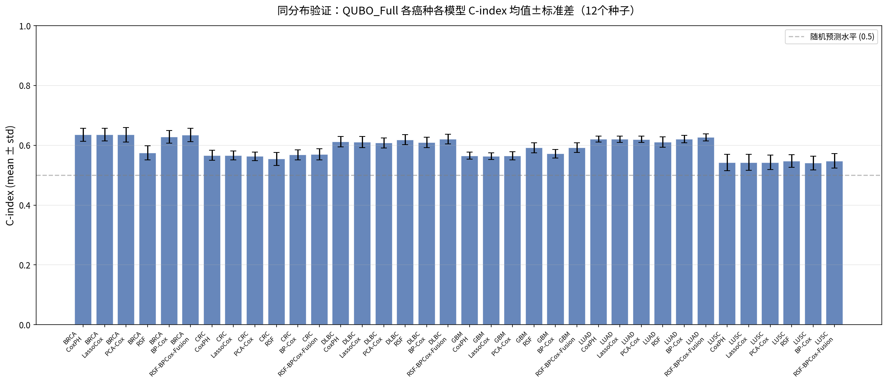
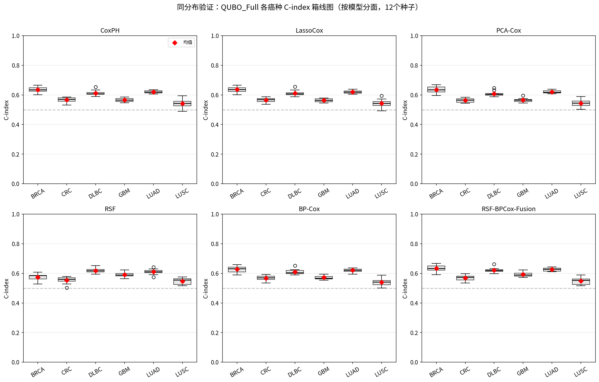
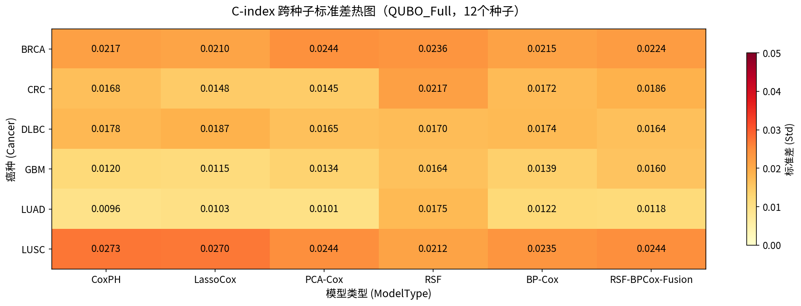
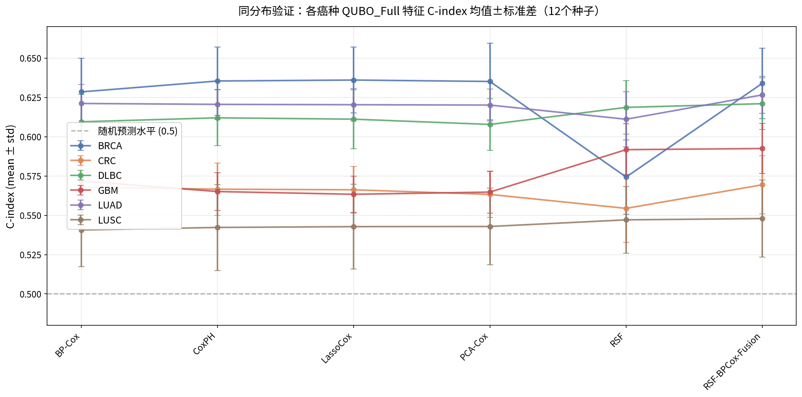

> 本文档是 QUBO-Fusion 多癌种预后研究合集的一部分。完整合集见仓库 docs/ 目录。

# 第三部分　补充材料二：同分布验证补充

## 随机种子同分布验证报告

## 一、验证概述

为系统评估QUBO基因选择方法在同分布（7:3随机划分）实验设置下的结果稳定性与可重复性，本验证采用12个不同随机种子（seed）对6种癌症类型进行完整复现实验。每个种子下均执行4种特征选择方法（QUBO_Full、QUBO_NoRedundancy、RandomGenes、TopCoxGenes）与6种预测模型（CoxPH、LassoCox、PCA-Cox、RSF、BP-Cox、RSF-BPCox-Fusion）的全组合实验。本验证共获得12×6×4×6 = 1,728个模型评估结果，用于评估同分布设置下不同随机划分对模型性能的影响。本报告以QUBO_Full为主要分析对象，辅以四特征集横向对比、配对差值检验、95%置信区间估计和种子42特异性Z-score分析。

**表1  随机种子同分布验证实验配置概况**

| 项目 | 配置内容 |
|---|---|
| 随机种子数 | 12个（0, 7, 13, 42, 123, 256, 512, 1024, 2024, 9999, 12345, 77777） |
| 癌症类型 | 6种（BRCA, CRC, DLBC, GBM, LUAD, LUSC） |
| 特征选择方法 | 4种（QUBO_Full, QUBO_NoRedundancy, RandomGenes, TopCoxGenes） |
| 预测模型 | 6种（CoxPH, LassoCox, PCA-Cox, RSF, BP-Cox, RSF-BPCox-Fusion） |
| 实验划分 | 同分布7:3随机划分（训练集:测试集） |
| 总评估结果 | 1,728个（12种子 × 6癌种 × 4特征集 × 6模型） |
| 评估指标 | C-index（一致性指数）、log-rank p值、HR（风险比） |
| 主要分析对象 | QUBO_Full（含冗余惩罚的完整QUBO基因选择） |

**表1汇总了本次验证实验的完整配置。本验证采用12个不同随机种子，以模拟不同训练/测试划分及模型随机初始化条件下的性能波动。6种癌症类型涵盖了乳腺癌（BRCA）、结直肠癌（CRC）、弥漫大B细胞淋巴瘤（DLBC）、胶质母细胞瘤（GBM）、肺腺癌（LUAD）和肺鳞癌（LUSC），具有不同的事件率和样本量特征。需要说明的是，同一seed、同一癌种下训练/测试划分是共享的，且QUBO基因选择结果会被多个模型复用，因此1,728个结果并非完全独立的样本，而是用于评估跨种子稳定性的结构化评估集合。**

## 二、QUBO_Full整体性能概览与95%置信区间

本节以QUBO_Full特征集为核心，展示12个随机种子下各癌种、各模型的C-index均值与标准差，并补充95%置信区间（95% CI = mean ± 1.96×std/√n，n=12）以量化均值估计的精度。均值反映模型的平均预测能力，标准差反映固定癌种-模型组合下种子间结果的波动程度，95% CI则反映跨种子均值估计的不确定性范围。

*图1  QUBO_Full各癌种各模型C-index均值±标准差柱状图*

*图1以柱状图形式展示QUBO_Full特征集下6种癌症、6种模型在12个随机种子上的C-index均值（柱高）与标准差（误差棒）。可以观察到：（1）BRCA的整体C-index最高，多数模型均值在0.63左右，反映乳腺癌中存在较强的线性预后信号；（2）LUSC的整体C-index最低，均值约0.54，预后信号较弱；（3）RSF在BRCA和CRC中表现相对较低，但在DLBC、GBM和LUSC中具有一定优势，提示不同癌种中线性与非线性预后信号结构存在差异；（4）误差棒长度普遍较小（多数在0.01~0.03之间），表明在固定癌种-模型组合下，12个种子间的结果波动有限，同分布实验具有较好的可重复性。*

**表2  QUBO_Full各癌种各模型C-index均值±标准差（12个种子）**

| 癌种 | CoxPH | LassoCox | PCA-Cox | RSF | BP-Cox | RSF-BPCox-Fusion |
|---|---|---|---|---|---|---|
| BRCA | 0.6354±0.0217 | 0.6360±0.0210 | 0.6351±0.0244 | 0.5743±0.0236 | 0.6285±0.0215 | 0.6340±0.0224 |
| CRC | 0.5666±0.0168 | 0.5662±0.0148 | 0.5633±0.0145 | 0.5544±0.0217 | 0.5680±0.0172 | 0.5694±0.0186 |
| DLBC | 0.6120±0.0178 | 0.6111±0.0187 | 0.6078±0.0165 | 0.6186±0.0170 | 0.6095±0.0174 | 0.6210±0.0164 |
| GBM | 0.5651±0.0120 | 0.5634±0.0115 | 0.5648±0.0134 | 0.5918±0.0164 | 0.5717±0.0139 | 0.5925±0.0160 |
| LUAD | 0.6206±0.0096 | 0.6203±0.0103 | 0.6201±0.0101 | 0.6111±0.0175 | 0.6211±0.0122 | 0.6266±0.0118 |
| LUSC | 0.5423±0.0273 | 0.5428±0.0270 | 0.5429±0.0244 | 0.5471±0.0212 | 0.5406±0.0235 | 0.5479±0.0244 |

**表2详细列出了QUBO_Full在各癌种各模型下的C-index均值与标准差，其中标准差是固定癌种-模型组合下跨12个种子的波动，是纯粹的种子稳定性指标。基于表2的均值和标准差，进一步计算各癌种-模型组合的95%置信区间（CI = mean ± 1.96×std/√12），结果见表2a。95% CI进一步显示，多数癌种-模型组合的跨种子均值估计区间较窄（CI半宽均值0.0101，最小0.0054，最大0.0155），说明同分布性能估计较稳定，12个种子已能提供较为精确的均值估计。其中LUAD-CoxPH的CI最窄（半宽0.0054），LUSC-CoxPH的CI最宽（半宽0.0155），与两者预后信号强度的差异一致。**

**表2a  QUBO_Full各癌种各模型C-index 95%置信区间（n=12，CI = mean ± 1.96×std/√12）**

| 癌种 | CoxPH | LassoCox | PCA-Cox | RSF | BP-Cox | RSF-BPCox-Fusion |
|---|---|---|---|---|---|---|
| BRCA | [0.6231, 0.6477] | [0.6242, 0.6479] | [0.6213, 0.6489] | [0.5610, 0.5877] | [0.6163, 0.6406] | [0.6213, 0.6467] |
| CRC | [0.5571, 0.5761] | [0.5578, 0.5746] | [0.5551, 0.5715] | [0.5421, 0.5667] | [0.5583, 0.5778] | [0.5589, 0.5799] |
| DLBC | [0.6019, 0.6221] | [0.6005, 0.6217] | [0.5985, 0.6171] | [0.6090, 0.6283] | [0.5996, 0.6193] | [0.6117, 0.6303] |
| GBM | [0.5583, 0.5719] | [0.5568, 0.5699] | [0.5572, 0.5723] | [0.5825, 0.6010] | [0.5639, 0.5796] | [0.5834, 0.6015] |
| LUAD | [0.6151, 0.6260] | [0.6145, 0.6262] | [0.6144, 0.6258] | [0.6012, 0.6210] | [0.6142, 0.6280] | [0.6199, 0.6333] |
| LUSC | [0.5268, 0.5577] | [0.5275, 0.5581] | [0.5290, 0.5567] | [0.5351, 0.5591] | [0.5274, 0.5539] | [0.5341, 0.5617] |

**表2a给出了各癌种-模型组合C-index均值的95%置信区间。所有组合的跨种子均值CI均高于0.5，说明在本次12个随机划分中，QUBO_Full各癌种-模型组合的平均C-index均稳定高于随机预测水平。需要注意的是，该CI主要反映跨种子均值的不确定性，并非严格的外部总体推断检验。CI的宽度直接反映了跨种子均值估计的精度——CI越窄，说明12个种子的均值估计越可靠。在部分癌种中，线性模型表现出较小的跨种子波动；但这一趋势并非所有癌种均一致，RSF在DLBC、GBM和LUSC中也表现出相对稳定或较高的平均性能。**

从表2的均值来看，BRCA的LassoCox最高（0.6360），DLBC的RSF-BPCox-Fusion次之（0.6210），LUAD的融合模型也达到0.6266。从标准差来看，LUAD的线性模型波动最小（CoxPH仅0.0096），而LUSC的波动最大（CoxPH达0.0273），这与LUSC预后信号较弱、对随机划分更敏感的特征一致。值得注意的是，GBM和DLBC中RSF及融合模型表现优于线性模型，提示这两种癌种中非线性预后信号更为突出。

## 三、跨模型-跨种子整体分布（箱线图分析）

箱线图能够直观展示各癌种在6种模型、12个种子共同作用下的C-index整体分布特征，包括中位数、四分位距（IQR）、whisker范围和异常值。需要强调的是，本节的分布同时包含模型差异和种子差异，因此IQR反映的是该癌种在不同模型与不同种子组合下的整体性能离散程度，并非单纯的种子波动指标。纯粹的跨种子稳定性应主要参考表2和表4中固定癌种-模型组合下的标准差。

*图2  QUBO_Full各癌种C-index箱线图（按模型分面，2×3布局）*

*图2以2×3分面布局展示6种预测模型下各癌种的C-index箱线图。每个子图对应一种模型，横轴为6种癌症，纵轴为C-index。红色菱形标记均值，灰色虚线为随机预测水平（C-index=0.5）。可以观察到：（1）大多数癌种-模型组合的C-index分布位于0.5以上，但LUSC在个别种子和模型组合下低于0.5（最小值0.4898），提示其预后信号较弱且对随机划分更敏感；（2）在每个模型子图内，LUAD的箱体最为紧凑，表明在固定模型下肺腺癌的种子间波动最小；（3）BRCA和LUSC的箱体相对较高或较宽，分别反映了高均值和高波动的特征；（4）RSF模型子图中出现了个别离群点（如CRC的低值离群点），提示RSF对随机划分较为敏感，在某些种子下可能出现性能骤降。*

**表3  QUBO_Full各癌种C-index分布统计（跨模型跨种子，n=72）**

| 癌种 | 中位数 | Q1 | Q3 | IQR | 最小值 | 最大值 | 极差 |
|---|---|---|---|---|---|---|---|
| BRCA | 0.6286 | 0.6031 | 0.6450 | 0.0419 | 0.5288 | 0.6691 | 0.1403 |
| CRC | 0.5688 | 0.5543 | 0.5767 | 0.0224 | 0.5029 | 0.5982 | 0.0953 |
| DLBC | 0.6087 | 0.6015 | 0.6233 | 0.0218 | 0.5874 | 0.6616 | 0.0743 |
| GBM | 0.5738 | 0.5627 | 0.5860 | 0.0233 | 0.5450 | 0.6240 | 0.0790 |
| LUAD | 0.6191 | 0.6118 | 0.6295 | 0.0177 | 0.5746 | 0.6440 | 0.0694 |
| LUSC | 0.5432 | 0.5242 | 0.5604 | 0.0362 | 0.4898 | 0.5951 | 0.1053 |

**表3汇总了各癌种在跨模型、跨种子条件下（每个癌种n=72，即6模型×12种子）的C-index分布统计。如前所述，IQR反映该癌种在不同模型与不同种子组合下的整体性能离散程度，并非单纯的种子波动指标。纯粹的跨种子稳定性应主要参考表2和表4中固定癌种-模型组合下的标准差。从表3可以看出，LUAD的IQR最小（0.0177），表明其中间50%的结果在模型和种子维度上都最为集中；DLBC（0.0218）和CRC（0.0224）次之；BRCA（0.0419）和LUSC（0.0362）的IQR较大，反映这两种癌种在模型间和种子间的整体离散度更高。从极差来看，BRCA最大（0.1403），主要受RSF模型低值拖累；LUAD最小（0.0694），整体表现最为均衡。所有癌种的中位数均高于0.5，但LUSC的最小值（0.4898）低于0.5，进一步说明弱预后信号癌种对随机划分的敏感性。**

## 四、固定癌种-模型下的跨种子波动（热图分析）

与表3的整体离散度不同，本节聚焦于固定癌种-模型组合下纯粹的跨种子波动。标准差热图以颜色梯度直观呈现各癌种×模型组合在12个种子间的C-index标准差。颜色越深（越偏红）表示种子间波动越剧烈；颜色越浅（越偏黄）表示越稳定。

*图3  QUBO_Full各癌种×模型C-index标准差热图（跨12个种子）*

*图3以热图形式展示QUBO_Full特征集下6种癌症×6种模型的C-index标准差矩阵，每个单元格的数值为固定癌种-模型组合下跨12个种子的标准差，是纯粹的种子稳定性指标。颜色条范围为0.00~0.05。可以观察到：（1）LUSC整行颜色最深，标准差普遍在0.021~0.027之间，是所有癌种中种子间波动最大的，其中CoxPH（0.0273）和LassoCox（0.0270）为全图最高值；（2）LUAD整行颜色最浅，线性模型的标准差仅0.0096~0.0103，是最为稳定的癌种；（3）GBM的线性模型也较为稳定（0.0115~0.0134），但RSF和融合模型波动增大（0.0160~0.0164）；（4）BRCA的各模型标准差较为均衡（0.0210~0.0244），处于中等波动水平。整体而言，在部分癌种中线性模型的种子间波动小于RSF和融合模型，但这一趋势并非所有癌种均一致。*

**表4  QUBO_Full各癌种×模型C-index标准差矩阵（跨12个种子）**

| 癌种 | CoxPH | LassoCox | PCA-Cox | RSF | BP-Cox | RSF-BPCox-Fusion |
|---|---|---|---|---|---|---|
| BRCA | 0.0217 | 0.0210 | 0.0244 | 0.0236 | 0.0215 | 0.0224 |
| CRC | 0.0168 | 0.0148 | 0.0145 | 0.0217 | 0.0172 | 0.0186 |
| DLBC | 0.0178 | 0.0187 | 0.0165 | 0.0170 | 0.0174 | 0.0164 |
| GBM | 0.0120 | 0.0115 | 0.0134 | 0.0164 | 0.0139 | 0.0160 |
| LUAD | 0.0096 | 0.0103 | 0.0101 | 0.0175 | 0.0122 | 0.0118 |
| LUSC | 0.0273 | 0.0270 | 0.0244 | 0.0212 | 0.0235 |  |

**表4给出了图3对应的精确标准差数值，所有数值均为固定癌种-模型组合下跨12个种子的标准差。全图最低值为LUAD-CoxPH（0.0096），意味着在12个种子间C-index的波动仅约0.01，具有极高的可重复性；全图最高值为LUSC-CoxPH（0.0273），约为前者的2.8倍。按癌种平均标准差排序：LUSC（0.0246）> BRCA（0.0224）> CRC（0.0173）> DLBC（0.0173）> GBM（0.0139）> LUAD（0.0119）。这一排序与癌种的预后信号强度呈负相关——信号越强的癌种（如LUAD），种子间波动越小；信号越弱的癌种（如LUSC），波动越大。**

## 五、模型间趋势对比（折线图分析）

折线图将各癌种在6种预测模型下的C-index均值连接起来，便于比较不同癌种在模型间的变化趋势，以及识别各癌种的最优模型选择。

*图4  QUBO_Full各癌种C-index均值±标准差折线图（按模型排列）*

*图4以折线图形式展示6种癌症在6种预测模型下的C-index均值（点）与标准差（误差棒）。可以观察到：（1）BRCA（蓝色线）在BP-Cox、CoxPH、LassoCox、PCA-Cox四种线性模型上保持高位平台（约0.63~0.64），但在RSF处骤降至约0.575，随后在融合模型回升至0.634，呈现明显的"V型"走势；（2）CRC（橙色线）整体处于低位（0.55~0.57），各模型间差异较小，RSF最低；（3）LUAD（绿色线）最为平稳，线性模型均在0.62左右，融合模型最高（0.627）；（4）GBM（红色线）和DLBC（棕色线）则呈现相反趋势——RSF和融合模型高于线性模型，表明这两种癌种中非线性模型更具优势；（5）LUSC（紫色线）整体最低且最为平坦，各模型均在0.54~0.55之间，模型选择对其影响有限。误差棒在RSF处普遍较大，进一步印证了RSF模型在部分癌种中的种子间不稳定性。*

**表5  QUBO_Full各癌种×模型C-index均值矩阵（12个种子平均）**

| 癌种 | CoxPH | LassoCox | PCA-Cox | RSF | BP-Cox | RSF-BPCox-Fusion | 最优模型 |
|---|---|---|---|---|---|---|---|
| BRCA | 0.6354 | 0.6360 | 0.6351 | 0.5743 | 0.6285 | 0.6340 | LassoCox |
| CRC | 0.5666 | 0.5662 | 0.5633 | 0.5544 | 0.5680 | 0.5694 | Fusion |
| DLBC | 0.6120 | 0.6111 | 0.6078 | 0.6186 | 0.6095 | 0.6210 | Fusion |
| GBM | 0.5651 | 0.5634 | 0.5648 | 0.5918 | 0.5717 | 0.5925 | Fusion |
| LUAD | 0.6206 | 0.6203 | 0.6201 | 0.6111 | 0.6211 | 0.6266 | Fusion |
| LUSC | 0.5423 | 0.5428 | 0.5429 | 0.5471 | 0.5406 | 0.5479 | Fusion |

**表5给出了图4对应的精确均值数据，并标注了各癌种的最优模型。6个癌种中有5个（CRC、DLBC、GBM、LUAD、LUSC）的最优模型为RSF-BPCox-Fusion，仅BRCA的最优模型为LassoCox。这一结果表明融合模型在大多数癌种中能够整合RSF的非线性捕获能力与BP-Cox的深度表示能力，取得优于单一模型的效果。BRCA是唯一的例外，其线性预后信号极强，LassoCox以其稀疏性和稳定性略胜一筹。从数值差距来看，各癌种最优模型与次优模型的差值通常很小（<0.005），说明在QUBO_Full特征集下，模型选择的影响远小于癌种本身预后信号强度的影响。**

## 六、种子42特异性Z-score分析

为检验特定随机种子是否会导致系统性偏差，本节以种子42（深度学习领域最常用的默认随机种子）为对象，计算其在每个癌种×特征集×模型组合下相对于12个种子总体分布的Z-score。Z-score = (Seed42_Cindex − Mean) / Std。本节采用|Z| > 1.5作为经验性偏离阈值，用于识别种子42相对于跨种子分布的异常程度。该阈值仅用于稳定性诊断，不等同于正式统计显著性检验。

**表6  种子42 Z-score偏离统计汇总**

| 统计项目 | 数量 | 占比 |
|---|---|---|
| 总组合数 | 144 | 100% |
| 正常（|Z| ≤ 1） | 96 | 66.7% |
| 明显偏高（Z > 1） | 20 | 13.9% |
| 明显偏低（Z < -1） | 28 | 19.4% |
| 经验阈值偏高（Z > 1.5） | 2 | 1.4% |
| 经验阈值偏低（Z < -1.5） | 9 | 6.3% |

**表6汇总了种子42在144个组合（6癌种×4特征集×6模型）下的Z-score分布。66.7%的组合处于正常范围（|Z|≤1），表明种子42在大多数情况下与12个种子的总体均值无明显差异。明显偏低组合（28个，19.4%）略多于明显偏高组合（20个，13.9%），提示种子42存在轻微的系统性偏低倾向，但幅度有限。超过经验阈值|Z|>1.5的组合共11个，占比7.6%，其中经验阈值偏低9个、经验阈值偏高2个。**

**表7  种子42经验阈值偏低组合详情（Z < -1.5）**

| 癌种 | 模型 | 种子42 C-index | 12种子均值 | Z-score |
|---|---|---|---|---|
| DLBC | RandomGenes-RSF | 0.5741 | 0.6184 | -2.60 |
| CRC | QUBO_Full-RSF | 0.5029 | 0.5544 | -2.37 |
| CRC | TopCoxGenes-RSF | 0.5024 | 0.5632 | -2.37 |
| DLBC | RandomGenes-Fusion | 0.5807 | 0.6233 | -2.34 |
| CRC | TopCoxGenes-Fusion | 0.5386 | 0.5736 | -2.02 |
| CRC | TopCoxGenes-LassoCox | 0.5371 | 0.5644 | -1.82 |
| DLBC | RandomGenes-BP-Cox | 0.5813 | 0.6130 | -1.68 |
| CRC | RandomGenes-RSF | 0.5259 | 0.5597 | -1.68 |
| CRC | QUBO_NoRed-RSF | 0.5130 | 0.5564 | -1.63 |

**表7列出了种子42经验阈值偏低的9个组合详情。值得注意的是，9个偏低组合中有6个涉及RSF模型（含Fusion中的RSF成分），且集中在CRC（5个）和DLBC（3个）两种癌种。最严重的偏离为DLBC-RandomGenes-RSF（Z=-2.60），种子42的C-index（0.5741）比均值（0.6184）低了约0.044。这一现象表明，种子42在CRC和DLBC的RSF模型上可能恰好遇到了不利的训练/测试划分，导致RSF的集成树构建受到影响。然而，这些异常主要集中在RSF和RandomGenes等不稳定组合上，QUBO_Full的线性模型（CoxPH、LassoCox、PCA-Cox）在种子42下均未出现经验阈值偏离，支持该组合在同分布设置下具有较好的跨种子稳定性。**

## 七、四特征集横向对比与配对差值检验

为全面评估QUBO基因选择相对于其他特征选择方法的表现，本节对4种特征集（QUBO_Full、QUBO_NoRedundancy、RandomGenes、TopCoxGenes）在全部1,728个评估结果中的整体C-index进行横向对比，并进一步采用配对差值检验（以相同seed、cancer、model为配对单位）评估QUBO_Full与其他方法的系统性差异。配对比较能够控制癌种、模型和种子的混杂效应，比整体均值对比更具统计效力。需要说明的是，由于432个配对结果中存在癌种和模型层面的结构相关性，以下t检验应视为探索性分析，而非严格的独立样本显著性检验。

**表8  四特征集整体C-index对比（跨癌种、跨模型、跨种子，n=432/特征集）**

| 特征集 | 均值 | 标准差 | 中位数 | 说明 |
|---|---|---|---|---|
| QUBO_Full | 0.5901 | 0.0370 | 0.5905 | 含冗余惩罚的完整QUBO |
| QUBO_NoRedundancy | 0.5927 | 0.0352 | 0.5931 | 无冗余惩罚的QUBO |
| RandomGenes | 0.5895 | 0.0353 | 0.5853 | 随机选择20个基因（弱基线） |
| TopCoxGenes | 0.5923 | 0.0341 | 0.5881 | 单变量Cox排序Top20（弱基线） |

**表8展示了4种特征集在全部实验中的整体C-index统计。QUBO_NoRedundancy均值最高（0.5927），TopCoxGenes次之（0.5923），QUBO_Full第三（0.5901），RandomGenes最低（0.5895）。四者均值差距极小（最大差值仅0.0032），表明在同分布上界实验中，四种特征选择方法整体表现接近，QUBO_Full未表现出稳定的整体性能优势。从标准差来看，TopCoxGenes最小（0.0341），QUBO_NoRedundancy次之（0.0352），QUBO_Full最大（0.0370）。需要强调的是，同分布7:3随机划分是方法潜力的上界参照，在此设置下各方法趋于接近是预期现象；QUBO的主要价值更多体现在特征压缩、冗余控制和跨队列验证场景中，而非同分布上界实验中的整体C-index优势。**

**表9  QUBO_Full与其他特征集的配对差值检验（同seed-cancer-model配对，n=432，探索性分析）**

| 比较 | 平均差值±标准差 | 差值中位数 | QUBO_Full胜率 | 差值95% CI | 探索性t检验p值 |
|---|---|---|---|---|---|
| QUBO_Full − RandomGenes | +0.0006±0.0203 | +0.0016 | 53.2% | [-0.0013, +0.0026] | 0.5137 |
| QUBO_Full − TopCoxGenes | −0.0022±0.0191 | −0.0029 | 44.0% | [-0.0040, -0.0004] | 0.0152 |
| QUBO_Full − QUBO_NoRedundancy | −0.0026±0.0205 | −0.0046 | 41.4% | [-0.0046, -0.0007] | 0.0080 |

**表9以相同seed、相同cancer、相同model为配对单位（共432个配对），计算了QUBO_Full与其他三种特征集的C-index差值，并报告平均差值±标准差、差值中位数、QUBO_Full胜率（差值>0的比例）、差值的95%置信区间和探索性单样本t检验p值（原假设：差值均值为0）。由于432个配对中存在癌种和模型层面的结构相关性，该t检验应视为探索性分析，提示存在统计上的微小差异，而非严格的独立样本显著性结论。结果显示：（1）QUBO_Full相对于RandomGenes的平均差值仅为+0.0006，胜率53.2%，95% CI包含0（[-0.0013, +0.0026]），探索性p=0.5137，远未达到统计学差异，说明QUBO_Full相对于随机选择在同分布下没有可检测的性能优势；（2）QUBO_Full相对于TopCoxGenes的平均差值为−0.0022，胜率44.0%，95% CI不包含0（[-0.0040, −0.0004]），探索性p=0.0152，提示存在统计上的微小差异，TopCoxGenes在同分布下略优于QUBO_Full；（3）QUBO_Full相对于QUBO_NoRedundancy的平均差值为−0.0026，胜率41.4%，95% CI不包含0（[-0.0046, −0.0007]），探索性p=0.0080，同样提示存在统计上的微小差异，去除冗余惩罚的QUBO变体在同分布下略优于含冗余惩罚的QUBO_Full。需要强调的是，上述差值仅约0.002~0.003，效应量极小，其临床意义有限（详见局限性第4点）。综合来看，同分布实验中QUBO与传统特征选择方法性能接近，QUBO_Full并未在同分布场景下表现出稳定的整体性能优势。这反而说明，QUBO方法的真实增量价值不应在同分布上界实验中寻找，而应结合跨数据集验证、特征压缩效率和冗余控制结果共同判断。**

## 八、结论

本报告基于12个随机种子、6种癌症、4种特征集、6种预测模型的1,728个同分布（7:3随机划分）模型评估结果，系统评估了QUBO基因选择方法的结果稳定性与可重复性。主要结论如下：

（1）整体可重复性良好。在固定癌种-模型组合下，QUBO_Full特征集的12个种子间C-index标准差普遍在0.01~0.03之间，LUAD的线性模型低至0.0096，95%置信区间半宽均值仅0.0101，表明同分布实验结果对随机种子不敏感，12个种子已能提供较为精确的均值估计。

（2）癌种预后信号强度是影响稳定性的重要因素。LUAD（固定模型下标准差约0.01）和DLBC（约0.017）等预后信号较强的癌种种子间波动较小，而LUSC（约0.025）波动最大。癌种间差异远大于模型间和种子间差异。需要说明的是，表3的IQR是跨模型+跨种子的整体离散度，并非纯种子波动指标；纯粹的跨种子稳定性应参考表2和表4的固定癌种-模型标准差。

（3）线性模型与RSF的稳定性因癌种而异。在BRCA、CRC、LUAD等癌种中，CoxPH、LassoCox、PCA-Cox等线性模型的种子间标准差普遍小于RSF；但在DLBC、GBM和LUSC中，RSF不仅平均性能较高，波动也处于可接受范围。RSF在CRC、DLBC等癌种上出现离群值，与其集成树对训练集划分敏感的特性一致。

（4）种子42无系统性严重偏差。种子42在66.7%的组合中处于正常范围，超过经验阈值|Z|>1.5的组合仅占7.6%，且主要集中在RSF和RandomGenes等不稳定组合。QUBO_Full的线性模型在种子42下未出现经验阈值偏离，支持该组合在同分布设置下具有较好的跨种子稳定性。

（5）融合模型在6个癌种中的5个取得最高平均C-index，但其相对次优模型的优势通常小于0.005，因此该结果更适合作为趋势性观察，而非强优势结论。仅BRCA的最优模型为LassoCox，反映其线性预后信号极强。

（6）同分布下四特征集性能接近，QUBO_Full未表现出整体性能优势。探索性配对差值检验（n=432）显示：QUBO_Full相对于RandomGenes差值仅+0.0006（95% CI包含0，探索性p=0.51，无统计学差异），相对于TopCoxGenes差值−0.0022（探索性p=0.015），相对于QUBO_NoRedundancy差值−0.0026（探索性p=0.008）。后两者虽提示统计上的微小差异，但效应量极小（约0.002~0.003），临床意义有限。这表明在同分布上界实验中，QUBO_Full并不优于甚至略低于其他特征选择方法。

综合而言，多随机种子验证表明，原始seed=42同分布结果并非由单一随机划分偶然驱动；在固定癌种-模型组合下，QUBO_Full的C-index跨种子波动整体较小，支持其在同分布设置下具有较好的可重复性。然而，在同分布上界实验中，各特征选择方法整体性能接近，QUBO_Full并未表现出相对于TopCoxGenes或QUBO_NoRedundancy的性能优势。因此，本补充实验主要支持同分布结果的跨种子稳定性，而QUBO方法的增量价值应结合跨数据集验证、特征压缩效率和冗余控制效果共同判断。

## 九、局限性

本验证存在以下局限性，在解读结果时应予注意：

（1）本验证仅针对同分布7:3随机划分，不替代跨数据集外部验证。由于训练集和测试集来自同一数据源，同分布性能仍可能高估真实临床泛化能力。同分布结果应被视为方法潜力的上界参照，而非真实世界表现的估计。

（2）12个随机种子虽然足以评估跨种子稳定性，但种子数量仍有限。更多种子（如50或100个）可能提供更精确的均值估计和更窄的置信区间，但计算成本也会相应增加。

（3）同一seed、同一癌种下训练/测试划分是共享的，且QUBO基因选择结果被多个模型复用，因此1,728个评估结果并非完全独立的统计样本。本报告中的标准差和置信区间主要用于描述性稳定性分析，而非严格的独立样本推断。配对t检验同样受结构相关性影响，应视为探索性分析。

（4）配对差值检验中发现的QUBO_Full相对于TopCoxGenes和QUBO_NoRedundancy的微小负向差异（约0.002~0.003）虽然在探索性t检验中达到p<0.05，但效应量极小，其临床意义有限。该差异更可能反映同分布上界实验中冗余惩罚项的轻微过拟合效应，而非QUBO方法的本质缺陷。

---
